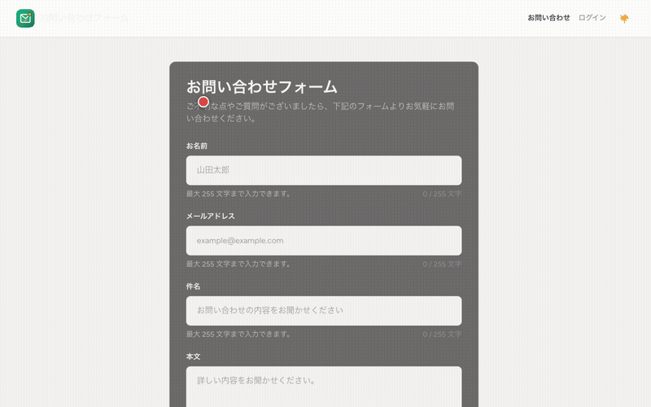
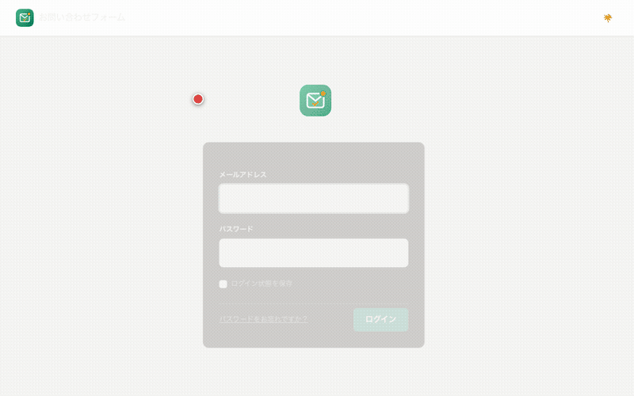
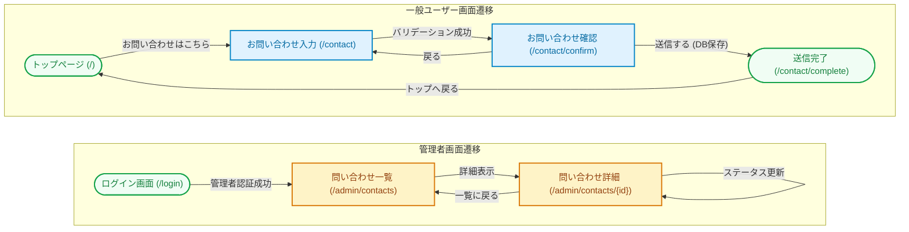
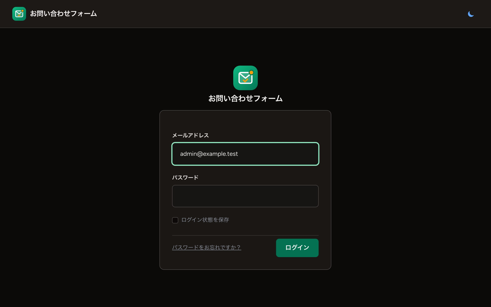
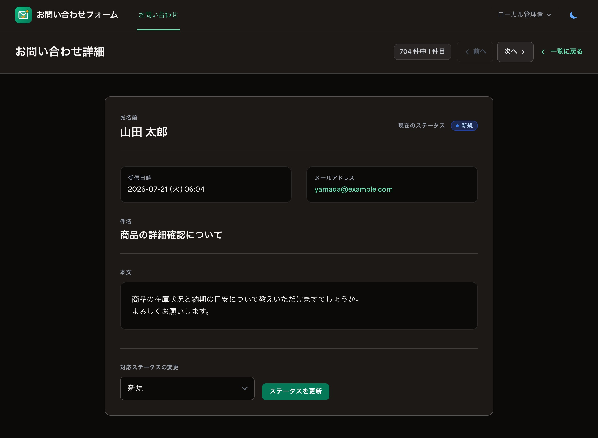

# お問い合わせフォーム

Laravel 13.x で構築したお問い合わせフォームアプリケーション。一般ユーザーからの問い合わせ受付と、管理者による問い合わせ管理を実現します。

- **公開フォーム**: 3ステップの入力・確認・送信フロー
- **管理画面**: 管理者認可付きの問い合わせ一覧・詳細・ステータス管理
- **認証**: Laravel Breeze（ブレード構成）
- **安全対策**: 管理者権限、Secure Cookie、公開フォームのレート制限、堅牢なエラーハンドリング（例外処理）、二重送信防止
- **UI品質**: 320pxからのレスポンシブ対応、ライト／ダークテーマ、キーボード・スクリーンリーダー・モーション抑制への配慮

---

## 目次

- [操作デモ（アニメーション）](#操作デモアニメーション)
- [画面遷移](#画面遷移)
- [機能](#機能)
  - [公開フォーム（/contact）](#公開フォームcontact)
  - [管理画面（/admin/contacts）](#管理画面admincontacts)
  - [レスポンシブ・アクセシビリティ・CSS構成](#レスポンシブ・アクセシビリティ・css構成)
  - [データベーススキーマ](#データベーススキーマ)
- [環境要件・技術スタック](#環境要件・技術スタック)
  - [必要要件](#必要要件)
  - [技術スタック](#技術スタック)
- [デプロイ方針](#デプロイ方針)
- [インストール・セットアップ](#インストール・セットアップ)
  - [1. インストール](#1-インストール)
  - [2. 初期セットアップ（自動 / 手動）](#2-初期セットアップ自動--手動)
  - [3. 既存環境の更新](#3-既存環境の更新)
- [主要コマンド](#主要コマンド)
  - [開発サーバーの起動](#開発サーバーの起動)
  - [ビルド・アセット](#ビルド・アセット)
  - [テストの実行](#テストの実行)
  - [コード品質（Laravel Pint）](#コード品質laravel-pint)
- [ディレクトリ構造](#ディレクトリ構造)
- [開発ガイド](#開発ガイド)
  - [ディレクトリ構成の原則](#ディレクトリ構成の原則)
  - [コーディング規約](#コーディング規約)
  - [ローカル開発フロー](#ローカル開発フロー)
- [テスト詳細・品質保証](#テスト詳細・品質保証)
  - [テストカバレッジ・統計](#テストカバレッジ統計)
  - [テスト実行例](#テスト実行例)
  - [テストデータベース](#テストデータベース)
- [トラブルシューティング](#トラブルシューティング)
- [ライセンス](#ライセンス)

---

## 操作デモ（アニメーション）

アプリケーションの主な操作の様子（文字数カウンター、確認画面遷移、管理者ログイン、テーマ切替、ステータス複数チェックボックス絞り込み、詳細周回ナビゲーション）のアニメーションデモです。

### 1. お問い合わせ入力〜確認〜送信完了



### 2. 管理画面操作（ログイン・テーマ切り替え・ステータス複数絞り込み・詳細閲覧）



---

## 画面遷移

本アプリケーションにおける一般ユーザーおよび管理者の画面遷移図です。



---

## 機能

### 公開フォーム（`/contact`）

認証不要で誰でもアクセス可能。

**ステップ1: 入力フォーム**


- お名前（必須、最大255文字）
- メールアドレス（必須、有効なメールアドレス形式、最大255文字）
- 件名（必須、最大255文字）
- 本文（必須、最大2000文字）
- 全入力項目に Alpine.js によるリアルタイム文字数カウンターを表示
- JavaScript の `Array.from()` とサーバー側の `mb_strlen()` により、絵文字を含む文字数判定を Unicode コードポイント単位で一致
- 最大文字数を超えると、カウンターおよび入力欄の枠線・文字色を赤色で警告表示し、`aria-invalid` も更新

**ステップ2: 確認画面**


- 入力内容を確認
- 「戻る」で入力値を保持した入力画面に戻る
- 「送信する」でデータベースに保存
  - フロントエンドで送信ボタンを非活性化し、連打による多重送信を防止
  - バックエンドでDB保存開始前にセッションデータを破棄（`pull`）し、ミリ秒単位の同時リクエスト（Race Condition）と重複登録を完全にブロック

**ステップ3: 完了画面**
- 「お問い合わせありがとうございました」メッセージ表示
- トップページへのリンク

**エラーハンドリングとUX**
- **例外処理とロギング**: DB接続エラー等の障害発生時は `DB::transaction` をロールバックし、エラー詳細を `Log::error` へ出力（本文などの個人情報は自動でマスク）。ユーザーには入力値を保持したまま「送信処理中にエラーが発生しました」と安全で親切な日本語エラーメッセージを表示して元の画面に戻します。
- **バリデーションの日本語化**: フォームリクエストの個別メッセージ定義（`messages()`）により、全てのルールにおいて完全な日本語でのエラー表示を提供します。
- **カスタムエラー画面**: HTTPステータスコードに応じた専用のエラーページを設置。サイト全体のデザインテーマと調和した 403 (権限エラー), 404 (存在しないページ), 429 (レート制限エラー), 500 (システムエラー) のビューを提供します。
- **入力支援**: 各入力欄を上限説明、文字数カウンター、サーバーエラーへ `aria-describedby` で関連付け、エラー領域を `role="alert"` で通知します。

**レート制限（IP単位）**
- 確認画面: 1分あたり30回
- DB保存: 1分あたり5回
- 上限値は `.env` の `CONTACT_CONFIRMATION_RATE_LIMIT` / `CONTACT_SUBMISSION_RATE_LIMIT` で変更可能

---

### 管理画面（`/admin/contacts`）

Laravel Breeze の認証と `is_admin` 権限で保護された管理者専用エリア。

**ログイン**



- ローカルでは `.env.example` からコピーされた開発専用認証情報で、シーダーから管理者を作成できます
- 本番では `ADMIN_EMAIL` / `ADMIN_PASSWORD` を環境固有の値へ置き換えてからシーダーを実行します
- 一般ユーザーは管理画面へアクセスできません

**一覧表示（`/admin/contacts`）**


**シーケンス番号＆高密度コンパクトUI**
- お問い合わせカード枠の左外側にページ跨ぎ対応の連番（`1`, `2`, `3` ... 数字のみ）を表示
- デスクトップでは日時・メール・本文プレビューを表示し、モバイルでは要点に絞って高さを抑えるレスポンシブな高密度設計

**表示件数の動的切り替え＆上下デュアルページネーション**
- 1ページあたりの件数（`5件`, `10件`, `20件`【デフォルト】, `50件`, `100件`, `200件`）を動的に選択可能
- 選択ドロップダウンは一覧の上下ページネーションボタンのすぐ左隣、および絞り込みフォーム内に配置
- 一覧の上部・下部の両方にページネーションコントロール（`data-pagination`）を完備
- ページネーションは日本語化され、現在ページと移動先をスクリーンリーダーへ伝えるラベル、44px以上の操作領域を備える

**絞り込み・ソート機能**（Ajax 非同期対応）
- キーワード検索（「名前・メール・件名」と「本文」を独立分離検索、デバウンス 400ms）
- 検索・指定履歴参照機能（LocalStorage 連動、オートコンプリート、ワンタップ引用、個別 `×` 削除、一括全削除）
- 登録日の期間指定（開始日・終了日、ブラウザ標準カレンダーピッカー起動）
- 絞り込みエリアの折りたたみ・展開（初回は640px未満で閉じ、640px以上で開く。以後は開閉状態をLocalStorageへ保存し、折りたたみ時は適用中条件バッジを表示）
- ステータス複数選択チェックボックス絞り込み（新規・対応中・解決済み。未選択および全選択時はすべてのステータスを表示）および絞り込み条件に連動するリアルタイム件数バッジ表示
- 並び順の変更（登録日時新しい順/古い順、ステータス順、名前順）
- 絞り込みをクリア（条件適用数をカウント表示する動的リセットボタン）

**一覧表示・多言語・デザイン**
- 受信日時で新しい順にソート（デフォルト）
- 本文プレビュー表示（先頭部分を抜粋）
- DBにはUTCで保存し、画面では既定で日本時間（`Asia/Tokyo`）表示
- 登録日時の表示表記統一：全画面で `2026-07-20 (月) 09:13` （`YYYY-MM-DD (ddd) HH:mm`）形式に統一して表示
- 全画面のヘッダー右端に統一配置されたテーマ切替ボタン（`<x-theme-toggle />`）でライト／ダークテーマを全画面でトグル可能
- ステータスバッジ付き（インジケーター付きのカラーリング表示）
- 完全多言語対応（日本語・英語辞書 `resources/lang/en.json` / `ja.json` / `pagination.php` 連動）
- 洗練されたブランドロゴアイコン＆ブラウザ Favicon（エメラルドグリーンSVG）統一適用
- 絞り込み条件付き URL を共有・ブックマーク・リロード可能（プログレッシブエンハンスメント）

**CSVエクスポート機能**
- 一覧の件数表示（「全 :count 件」）の右側に「CSVエクスポート」ボタンを配置。
- 現在のキーワード検索、ステータス、登録日、ソートなどの絞り込み条件に一致する全件（ページネーションを除く）を、Excel等での文字化けを防ぐため UTF-8 with BOM 形式でストリーミング（メモリ効率が良い `cursor()` 方式）ダウンロード可能。
- **安全対策・各種制限**:
  - **CSVインジェクション対策**: `=`, `+`, `-`, `@`, `＝`, `＋`, `－`, `＠` などの危険な記号で始まるフィールドの先頭に `\t` を自動付与。
  - **エクスポート上限数**: システム負荷防止のため最大 10,000 件に制限（超過時は 422 制限超過画面へ遷移、`.env` の `CONTACT_EXPORT_LIMIT` で設定可能）。
  - **レート制限 (Throttle)**: 1分間あたり2回までのリクエスト制限を適用。
  - **アクセス監査ログ**: エクスポート実行時、操作者の管理者ID、適用した検索・ソートフィルター条件、出力件数を `Log::info` に出力。

**詳細表示＆ステータス管理（`/admin/contacts/{id}`）**



- 問い合わせ内容を確認
- 条件を維持したまま周回できる「前へ」「次へ」ナビゲーション（「X件中Y件目」表示）
- ステータスをドロップダウンで変更
  - 新規（new）
  - 対応中（in_progress）
  - 解決済み（resolved）
- 更新ボタンで保存
- 一覧に戻るリンク（元の絞り込み・ソート・`page`・`per_page` クエリパラメータを保持）

---

### レスポンシブ・アクセシビリティ・CSS構成

- 公開画面と管理画面をモバイルファーストで構成し、320px幅からデスクトップまで横スクロールなしで利用可能
- ハンバーガーメニューと絞り込み開閉に `aria-controls` / `aria-expanded`、ナビゲーションとページ移動に日本語のアクセシブルネームを設定
- ボタン、セレクト、ページ移動など主要操作のタップ領域を原則44px以上に統一
- `prefers-color-scheme` に応じたライト／ダークテーマと、`prefers-reduced-motion` に応じたアニメーション抑制に対応
- 色は `resources/css/app.css` のCSSカスタムプロパティを、`tailwind.config.js` の `brand.*` セマンティックトークンへマッピング。前景色の `brand-primary` と白文字用背景色の `brand-action` を分離し、両テーマでコントラストを維持
- カスタムページネーションは `resources/views/vendor/pagination/tailwind.blade.php` に集約

---

### データベーススキーマ

**contacts テーブル**

| カラム | 型 | 説明 |
|--------|-----|------|
| id | bigint | 主キー |
| name | varchar(255) | お名前 |
| email | varchar(255) | メールアドレス |
| subject | varchar(255) | 件名 |
| body | text | 本文 |
| status | varchar(255) | ステータス（new / in_progress / resolved） |
| created_at | timestamp | 作成日時（UTC） |
| updated_at | timestamp | 更新日時（UTC） |

---

## 環境要件・技術スタック

### 必要要件

- PHP 8.3 以上
- Node.js 20 以上（フロントエンドアセットビルド用）
- Composer
- SQLite（正式な本番出荷構成を含む標準データベース）

### 技術スタック

| 技術 | バージョン | 用途 |
|------|-----------|------|
| Laravel | 13.x | Webフレームワーク |
| PHP | 8.3+ | バックエンド言語 |
| Laravel Breeze | 2.4+ | 認証スカフォルディング |
| Tailwind CSS | v3.4 | スタイリング |
| Alpine.js | 3.x | 文字数カウンター・絞り込みUIの状態管理 |
| Vite | 8.1+ | 開発サーバー・アセットビルド |
| SQLite | - | データベース |
| PHPUnit | - | テストフレームワーク |
| Laravel Pint | - | コード整形ツール |

---

## デプロイ方針

正式にサポートする本番出荷構成は、1台のホスト、永続ローカルファイルシステム、SQLiteの組み合わせです。同一ホスト内では複数のPHP-FPM workerを利用できますが、すべてのworkerが同じSQLiteファイルを参照します。

Cloud Run等の複数インスタンス、ネットワークファイルシステム、Cloud SQL／Supabase等の外部DBは、現在の正式な出荷構成には含まれません。別構成へ移行するときは、DB整合性、排他制御、ファイル配信、バックアップを再設計・再検証します。

決定理由、代替案、移行条件は [ADR-001: 単一ホストとローカルSQLiteを正式な出荷構成とする](docs/decisions/001-single-host-sqlite-deployment.md) を参照してください。

---

## インストール・セットアップ

### 1. インストール

```bash
# リポジトリをクローン
git clone <repository-url>
cd myproject

# Composer 依存関係をインストール
composer install

# Node 依存関係をインストール
npm install
```

### 2. 初期セットアップ（自動 / 手動）

#### 推奨: 自動セットアップ

`.env.example` はローカル開発用の値が設定済みです。`.env` がまだない状態で次のコマンドを実行すれば、設定値を手編集せずにローカル環境を構築できます。

```bash
composer setup
php artisan db:seed
```

この手順では以下を実行します：

- `.env.example` を `.env` へコピー（既存の `.env` は保持）
- 開発環境固有の `APP_KEY` を生成
- SQLiteデータベースのマイグレーションを実行
- Node依存関係をインストールし、フロントエンドアセットをビルド
- `.env` のローカル用認証情報から管理者アカウントを作成

ローカル管理者のログイン情報は、コピーされた `.env` の `ADMIN_EMAIL` / `ADMIN_PASSWORD` を使用します。

#### 手動セットアップ

以下の手順で個別に実行することも可能です：

```bash
# ローカル用設定をコピー
cp .env.example .env

# アプリケーションキーを生成
php artisan key:generate

# データベースを作成し、ローカル管理者を登録
php artisan migrate --seed

# フロントエンドアセットをビルド
npm run build
```

### 3. 既存環境の更新

管理者認可、表示タイムゾーン、Secure Cookie、問い合わせレート制限を既存環境へ反映する場合は、`.env` に以下を設定します。

```dotenv
APP_TIMEZONE=UTC
APP_DISPLAY_TIMEZONE=Asia/Tokyo

ADMIN_NAME=管理者
ADMIN_EMAIL=admin@example.com
ADMIN_PASSWORD=

SESSION_ENCRYPT=true
SESSION_SECURE_COOKIE=true
SESSION_SAME_SITE=strict

CONTACT_CONFIRMATION_RATE_LIMIT=30
CONTACT_SUBMISSION_RATE_LIMIT=5
CONTACT_EXPORT_LIMIT=10000
```

設定後、キャッシュを破棄してからマイグレーションと管理者シーダーを実行します：

```bash
php artisan config:clear
php artisan migrate --force
php artisan db:seed --class=AdminUserSeeder --force
```

---

## 主要コマンド

### 開発サーバーの起動

```bash
# 開発サーバー起動（Artisan Serve, Vite, Queue, Pailログを並列起動）
composer dev
```

アクセス先：
- アプリケーション: <http://localhost:8000>
- Vite HMR: <http://localhost:5173>

### ビルド・アセット

```bash
# 本番用にアセットをビルド
npm run build

# 開発用にアセットをビルド（ソースマップ付き）
npm run dev
```

### テストの実行

```bash
# 全テストを実行（全97件・292アサーション PASS）
composer test

# テストカバレッジ測定 (全クラス 100.0% カバレッジ)
php artisan test --coverage
```

### コード品質（静的解析・一括整形）

```bash
# Pint、remark-cli、htmlhint、eslint を一括実行
npm run lint

# PHP コード整形（Laravel Pint）
vendor/bin/pint

# PHP 整形チェック
vendor/bin/pint --test
```

---

## ディレクトリ構造

主要なディレクトリ・ファイル構成です。

```
.
├── app/
│   ├── Enums/
│   │   └── ContactStatus.php       # ステータス Enum（New, InProgress, Resolved）
│   ├── Http/
│   │   ├── Controllers/
│   │   │   ├── Admin/
│   │   │   │   └── ContactController.php # 管理画面コントローラー
│   │   │   └── ContactController.php      # 公開フォームコントローラー
│   │   └── Requests/
│   │       ├── StoreContactRequest.php     # 公開フォームバリデーション
│   │       └── UpdateContactStatusRequest.php # ステータス更新バリデーション
│   └── Models/
│       ├── Contact.php              # お問い合わせモデル（スコープ・フォーマットアクセサ定義）
│       └── User.php                 # ユーザーモデル（is_admin 判定）
├── database/
│   ├── factories/
│   │   └── ContactFactory.php
│   ├── migrations/
│   │   └── 2026_03_05_000001_create_contacts_table.php
│   └── seeders/
│       ├── AdminUserSeeder.php      # 管理者登録
│       ├── ContactSeeder.php        # 問い合わせダミーデータ（100件）
│       └── DatabaseSeeder.php
├── resources/
│   ├── css/
│   │   └── app.css                  # CSS カスタムプロパティ（ブランドカラー）
│   ├── js/
│   │   └── app.js                   # Alpine.js（文字数カウンター・絞り込み・テーマ状態管理）
│   ├── lang/
│   │   ├── en.json / ja.json        # 画面ラベル多言語ファイル
│   │   └── en/ja/pagination.php     # ページネーション多言語ファイル
│   └── views/
│       ├── admin/contacts/          # 管理画面ビュー（index, show, _list）
│       ├── components/              # 共通ビューコンポーネント（theme-toggle 等）
│       ├── contact/                 # 公開フォームビュー（index, confirm, complete）
│       └── errors/                  # カスタムエラーページ（403, 404, 429, 500）
├── screenshots/                     # スクリーンショット・操作デモ GIF 保存先
├── tests/
│   └── Feature/
│       ├── Admin/ContactControllerTest.php # 管理機能テスト
│       └── ContactTest.php                 # 公開フォームテスト
├── CLAUDE.md                        # AIエージェント開発ルール・仕様書
└── README.md                        # プロジェクト説明ドキュメント
```

---

## 開発ガイド

### ディレクトリ構成の原則

- **コントローラー**: `app/Http/Controllers/` 配下に配置。管理画面用は `Admin/` サブディレクトリに分離
- **フォームリクエスト**: バリデーションルールとカスタムメッセージは `app/Http/Requests/` に集約
- **ビュー**: `resources/views/` 配下に機能別に整理。共通レイアウトは `layouts/`、コンポーネントは `components/`
- **テスト**: `tests/Feature/` に機能テストを配置

### コーディング規約

- **PSR-12**: Laravel Pint で全コードを自動整形で維持
- **型宣言**: 引数と戻り値に型宣言を明記
- **コメント**: PHPdoc およびインラインコメントは日本語で記述
- **アクセシビリティ**: 新規フォーム項目には `aria-describedby`、カウンターには `aria-live` を付与

### ローカル開発フロー

1. 機能ブランチを作成: `git checkout -b feature/your-feature-name`
2. コード変更を実装
3. 整形チェックを実行: `vendor/bin/pint --test`
4. テストを実行し 100% カバレッジを確認: `php artisan test --coverage`
5. 必要に応じてスクリーンショットや GIF デモを更新
6. コミットを作成しプッシュ

---

## テスト詳細・品質保証

### テストカバレッジ・統計

本プロジェクトは **全クラス 100.0% のテストカバレッジ** を達成し維持しています。

| テストスイート | テスト数 | アサーション数 | カバレッジ |
|---------------|---------|--------------|-----------|
| 全機能・モデル・コントローラー | 108 | 335 | **100.0%** |

主要テスト対象：
- **公開フォーム**: 正常系入力・送信、全バリデーションエラー、二重送信ブロック、レート制限、エラー時ログマスク
- **管理機能**: 管理者認証・認可 (403/404)、一覧表示、絞り込み（キーワード・本文分離・複数ステータス・日付範囲）、表示件数切り替え、前へ/次へナビゲーション、ステータス更新
- **CSVエクスポート**: 認証・認可、フィルタ適用、タイブレーカー付きソート順一致、CSVインジェクション対策、最大上限件数エラー (422)、レート制限、UTF-8 BOM確認
- **アクセス制御**: 一般ユーザー・未認証ユーザーの保護領域ブロック

### テスト実行例

```bash
# 全テストとカバレッジを出力
php artisan test --coverage

# 特定の機能テストのみ実行
php artisan test tests/Feature/Admin/ContactControllerTest.php

# 特定のテストメソッドのみ実行
php artisan test --filter=test_index_filters_by_status
```

### テストデータベース

テストはインメモリ SQLite（`:memory:`）またはテスト用データベースで高速に実行されます。`phpunit.xml` で `DB_CONNECTION=sqlite` が設定されています。

---

## トラブルシューティング

### 問題: Node モジュール エラー

**症状**: `npm run dev` または `npm run build` でモジュールが見つからないエラーが発生する

**対策**:
```bash
rm -rf node_modules package-lock.json
npm install
```

### 問題: コンポーザー依存関係エラー

**症状**: `composer install` でクラスが見つからない、または Autoload エラーが発生する

**対策**:
```bash
composer dump-autoload
composer install
```

### 問題: マイグレーションエラー

**症状**: `php artisan migrate` でテーブルが既に存在するなどのエラーが発生する

**対策**:
```bash
# データベースをリセットしてシードを再実行（ローカル環境のみ）
php artisan migrate:fresh --seed
```

### 問題: .env ファイルが見つからない

**症状**: `APP_KEY` 未設定や DB 接続エラーが発生する

**対策**:
```bash
cp .env.example .env
php artisan key:generate
```

### 問題: ポート 8000 / 5173 が使用中

**症状**: 開発サーバー起動時に `Address already in use` が表示される

**対策**:
```bash
# ポート番号を指定して起動
php artisan serve --port=8080
npx vite --port=5174
```

---

## ライセンス

本プロジェクトは MIT ライセンス のもとで公開されています。
