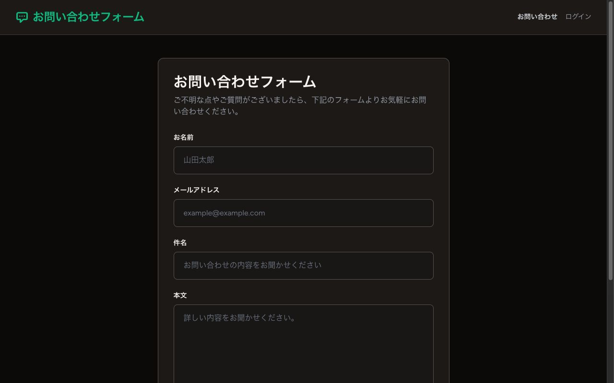
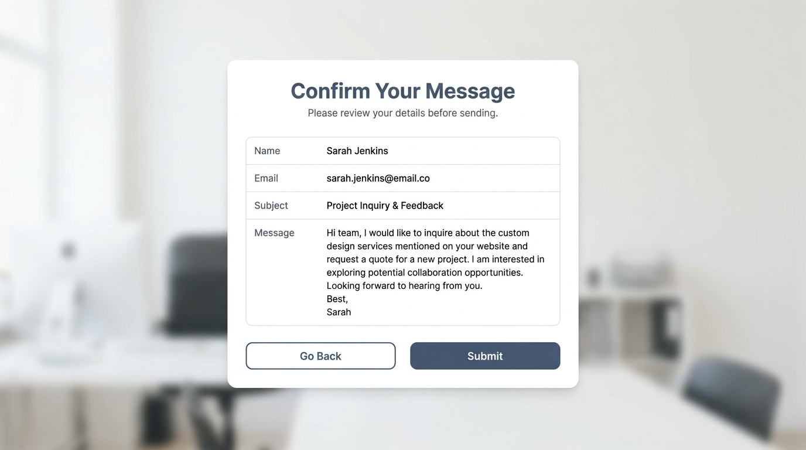
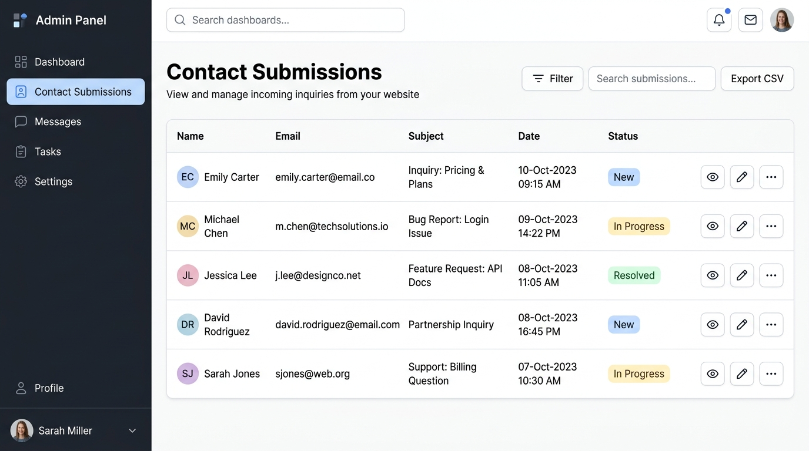

# お問い合わせフォーム

Laravel 13.x で構築したお問い合わせフォームアプリケーション。一般ユーザーからの問い合わせ受付と、管理者による問い合わせ管理を実現します。

- **公開フォーム**: 3ステップの入力・確認・送信フロー
- **管理画面**: 管理者認可付きの問い合わせ一覧・詳細・ステータス管理
- **認証**: Laravel Breeze（ブレード構成）
- **安全対策**: 管理者権限、Secure Cookie、公開フォームのレート制限、堅牢なエラーハンドリング（例外処理）、二重送信防止

## 目次

- [必要要件](#必要要件)
- [技術スタック](#技術スタック)
- [インストール](#インストール)
- [初期セットアップ](#初期セットアップ)
- [既存環境の更新](#既存環境の更新)
- [主要コマンド](#主要コマンド)
- [機能](#機能)
- [ディレクトリ構造](#ディレクトリ構造)
- [開発](#開発)
- [テスト](#テスト)
- [トラブルシューティング](#トラブルシューティング)

## 必要要件

- PHP 8.3 以上
- Node.js 20 以上（フロントエンドアセットビルド用）
- Composer
- SQLite（デフォルト。他のDBも使用可）

## 技術スタック

| 技術 | バージョン | 用途 |
|------|-----------|------|
| Laravel | 13.x | Webフレームワーク |
| PHP | 8.3+ | バックエンド言語 |
| Laravel Breeze | 2.4+ | 認証スカフォルディング |
| Tailwind CSS | v3.4 | スタイリング |
| Vite | 8.1+ | 開発サーバー・アセットビルド |
| SQLite | - | データベース |
| PHPUnit | - | テストフレームワーク |
| Laravel Pint | - | コード整形ツール |

## インストール

### 1. リポジトリをクローン

```bash
git clone <repository-url>
cd myproject
```

### 2. Composer 依存関係をインストール

```bash
composer install
```

### 3. Node 依存関係をインストール

```bash
npm install
```

## 初期セットアップ

### 推奨: 自動セットアップ

`.env.example` はローカル開発用の値が設定済みです。`.env` がまだない状態で次のコマンドを実行すれば、設定値を手編集せずにローカル環境を構築できます。

```bash
composer setup
php artisan db:seed
```

この手順では以下を実行します：

- `.env.example` を `.env` へコピー（既存の `.env` は保持）
- 開発環境固有の `APP_KEY` を生成
- SQLiteデータベースのマイグレーションを実行
- Node依存関係をインストールし、フロントエンドアセットをビルド
- `.env` のローカル用認証情報から管理者アカウントを作成

ローカル管理者のログイン情報は、コピーされた `.env` の `ADMIN_EMAIL` / `ADMIN_PASSWORD` を使用します。これらは公開済みの開発専用値であり、秘密情報ではありません。本番環境や外部公開される共有環境では絶対に使用せず、環境固有の値へ置き換えてください。

### 手動セットアップ

以下の手順で個別に実行することも可能です：

```bash
# ローカル用設定をコピー（設定値の手編集は不要）
cp .env.example .env

# 共有できないアプリケーションキーを環境ごとに生成
php artisan key:generate

# データベースを作成し、ローカル管理者を登録
php artisan migrate --seed

# フロントエンドアセットをビルド
npm run build
```

`APP_KEY` は秘密情報のため `.env.example` では意図的に空欄です。`composer setup` または `php artisan key:generate` が自動設定するため、手入力する必要はありません。

## 既存環境の更新

管理者認可、表示タイムゾーン、Secure Cookie、問い合わせレート制限を既存環境へ反映する場合は、`.env` に以下を設定します。`ADMIN_PASSWORD` には既知の固定値ではなく、新しく生成した値を使用してください。

```bash
openssl rand -hex 24
```

```dotenv
APP_TIMEZONE=UTC
APP_DISPLAY_TIMEZONE=Asia/Tokyo

ADMIN_NAME=管理者
ADMIN_EMAIL=admin@example.com
ADMIN_PASSWORD=

SESSION_ENCRYPT=true
SESSION_SECURE_COOKIE=true
SESSION_SAME_SITE=strict

CONTACT_CONFIRMATION_RATE_LIMIT=30
CONTACT_SUBMISSION_RATE_LIMIT=5
```

設定後、キャッシュを破棄してからマイグレーションと管理者シーダーを続けて実行します。

```bash
php artisan config:clear
php artisan migrate --force
php artisan db:seed --class=AdminUserSeeder --force
```

`is_admin` カラムの既定値は `false` です。既存ユーザーはマイグレーション直後には管理画面へアクセスできないため、管理者シーダーまで同じメンテナンス作業内で完了してください。`.env` はGit管理対象外です。

## 主要コマンド

### 開発

```bash
# 開発サーバー起動（Artisan Serve + Vite + Queue + Pail ログを並列実行）
composer dev
```

開発サーバーが起動すると、以下にアクセス可能になります：
- アプリケーション: http://localhost:8000
- Vite HMR: http://localhost:5173

### ビルド・アセット

```bash
# 本番用にアセットをビルド
npm run build

# 開発用にアセットをビルド（ソースマップ付き）
npm run dev
```

### テスト

```bash
# テストを実行
composer test

# または直接実行
php artisan test

# 特定のテストクラスのみ実行
php artisan test --filter=ContactFormTest
```

### コード品質

```bash
# コード整形（Laravel Pint）
vendor/bin/pint

# 整形チェック（修正なし）
vendor/bin/pint --test

# 特定ファイルを整形
vendor/bin/pint app/Models
```

## 機能

### 公開フォーム（`/contact`）

認証不要で誰でもアクセス可能。

**ステップ1: 入力フォーム**



- お名前（必須、最大255文字）
- メールアドレス（必須、有効なメールアドレス形式）
- 件名（必須、最大255文字）
- 本文（必須、最大2000文字）

**ステップ2: 確認画面**



- 入力内容を確認
- 「戻る」で入力値を保持した入力画面に戻る
- 「送信する」でデータベースに保存
  - フロントエンドで送信ボタンを非活性化し、連打による多重送信を防止
  - バックエンドでDB保存開始前にセッションデータを破棄（`pull`）し、ミリ秒単位の同時リクエスト（Race Condition）と重複登録を完全にブロック

**ステップ3: 完了画面**
- 「お問い合わせありがとうございました」メッセージ表示
- トップページへのリンク

**エラーハンドリングとUX**
- **例外処理とロギング**: DB接続エラー等の障害発生時は `DB::transaction` をロールバックし、エラー詳細を `Log::error` へ出力（本文などの個人情報は自動でマスク）。ユーザーには入力値を保持したまま「送信処理中にエラーが発生しました」と安全で親切な日本語エラーメッセージを表示して元の画面に戻します。
- **バリデーションの日本語化**: フォームリクエストの個別メッセージ定義（`messages()`）により、全てのルールにおいて完全な日本語でのエラー表示を提供します。
- **カスタムエラー画面**: HTTPステータスコードに応じた専用のエラーページを設置。サイト全体のデザインテーマと調和した 403 (権限エラー), 404 (存在しないページ), 429 (レート制限エラー), 500 (システムエラー) のビューを提供します。

**レート制限（IP単位）**
- 確認画面: 1分あたり30回
- DB保存: 1分あたり5回
- 上限値は `.env` の `CONTACT_CONFIRMATION_RATE_LIMIT` / `CONTACT_SUBMISSION_RATE_LIMIT` で変更可能

### 管理画面（`/admin/contacts`）

Laravel Breeze の認証と `is_admin` 権限で保護された管理者専用エリア。

**ログイン**
- ローカルでは `.env.example` からコピーされた開発専用認証情報で、シーダーから管理者を作成できます
- 本番では `ADMIN_EMAIL` / `ADMIN_PASSWORD` を環境固有の値へ置き換えてからシーダーを実行します
- 一般ユーザーは管理画面へアクセスできません

**一覧表示（`/admin/contacts`）**



- 受信日時で新しい順にソート
- DBにはUTCで保存し、画面では既定で日本時間（`Asia/Tokyo`）表示
- 20件ごとにページネーション
- ステータスバッジ付き（新規=青、対応中=黄、解決済み=緑）
- 詳細へのリンク

**詳細表示＆ステータス管理（`/admin/contacts/{id}`）**
- 問い合わせ内容を確認
- ステータスをドロップダウンで変更
  - 新規（new）
  - 対応中（in_progress）
  - 解決済み（resolved）
- 更新ボタンで保存
- 一覧に戻るリンク

### データベーススキーマ

**contacts テーブル**

| カラム | 型 | 説明 |
|--------|-----|------|
| id | bigint | 主キー |
| name | varchar(255) | お名前 |
| email | varchar(255) | メールアドレス |
| subject | varchar(255) | 件名 |
| body | text | 本文 |
| status | varchar(20) | ステータス（new/in_progress/resolved） |
| created_at | timestamp | 作成日時 |
| updated_at | timestamp | 更新日時 |

**users テーブルの管理者権限**

| カラム | 型 | 説明 |
|--------|-----|------|
| is_admin | boolean | 管理画面へのアクセス可否（既定値: false） |

## ディレクトリ構造

```
myproject/
├── app/
│   ├── Enums/
│   │   └── ContactStatus.php           # ステータス Enum
│   ├── Http/
│   │   ├── Controllers/
│   │   │   ├── ContactController.php   # 公開フォームコントローラー
│   │   │   ├── Admin/
│   │   │   │   └── ContactController.php   # 管理画面コントローラー
│   │   │   └── Auth/                   # 認証関連（Breeze生成）
│   │   └── Requests/
│   │       ├── StoreContactRequest.php     # 問い合わせ送信バリデーション
│   │       └── UpdateContactStatusRequest.php  # ステータス更新バリデーション
│   ├── Models/
│   │   ├── Contact.php                 # 問い合わせモデル
│   │   └── User.php                    # ユーザーモデル
│   └── View/Components/                # Blade コンポーネント（Breeze生成）
├── database/
│   ├── migrations/
│   │   ├── xxxx_create_users_table.php
│   │   ├── xxxx_add_is_admin_to_users_table.php  # 管理者権限
│   │   ├── xxxx_create_contacts_table.php  # 問い合わせテーブルマイグレーション
│   │   └── ...
│   ├── factories/
│   │   ├── UserFactory.php
│   │   └── ContactFactory.php          # テスト用ダミーデータ生成
│   └── seeders/
│       ├── DatabaseSeeder.php
│       └── AdminUserSeeder.php         # 管理者アカウント作成
├── resources/
│   ├── views/
│   │   ├── contacts/                   # 公開フォームビュー
│   │   │   ├── create.blade.php        # 入力フォーム
│   │   │   ├── confirm.blade.php       # 確認画面
│   │   │   └── complete.blade.php      # 完了画面
│   │   ├── admin/contacts/             # 管理画面ビュー
│   │   │   ├── index.blade.php         # 一覧表示
│   │   │   └── show.blade.php          # 詳細表示
│   │   ├── layouts/
│   │   │   ├── app.blade.php           # 認証済みレイアウト
│   │   │   ├── guest.blade.php         # ゲストレイアウト
│   │   │   └── public.blade.php        # 公開フォームレイアウト
│   │   ├── auth/                       # ログイン等（Breeze生成）
│   │   └── components/                 # UI コンポーネント（Breeze生成）
│   ├── css/
│   │   └── app.css                     # Tailwind CSS
│   └── js/
│       └── app.js
├── routes/
│   ├── web.php                         # Web ルート
│   └── auth.php                        # 認証ルート（Breeze生成）
├── tests/
│   ├── Feature/
│   │   ├── ContactFormTest.php         # 公開フォーム・レート制限テスト
│   │   ├── AdminUserSeederTest.php     # 安全な管理者作成テスト
│   │   ├── Admin/
│   │   │   └── ContactControllerTest.php   # 管理者認可・管理画面テスト
│   │   └── Auth/                       # 認証テスト（Breeze生成）
│   └── TestCase.php                    # テストベースクラス
├── config/
│   ├── admin.php                        # 管理者作成設定
│   └── contact.php                      # 問い合わせレート制限設定
├── composer.json                       # PHP 依存関係
├── package.json                        # Node 依存関係
├── vite.config.js                      # Vite 設定
├── tailwind.config.js                  # Tailwind CSS 設定
├── .env.example                        # 環境変数テンプレート
├── phpunit.xml                         # PHPUnit 設定
└── README.md                           # このファイル
```

## 開発

### ディレクトリ構成の原則

- **モデル**: `app/Models/` - ビジネスロジックとドメインコード
- **コントローラー**: `app/Http/Controllers/` - リクエスト処理ロジック
- **リクエスト**: `app/Http/Requests/` - バリデーション規則
- **Enum**: `app/Enums/` - 列挙型定義
- **ビュー**: `resources/views/` - テンプレート（レイアウト別に整理）
- **テスト**: `tests/Feature/` - 機能テスト

### コーディング規約

- **PHP コードスタイル**: PSR-12
- **型ヒント**: 可能な限り使用
- **コメント**: 日本語で、必要な場合のみ（WHY を説明）
- **命名規則**:
  - メソッド・変数: `camelCase`
  - クラス: `PascalCase`
  - Enum: `PascalCase`
  - 定数: `UPPER_SNAKE_CASE`
- **整形**: `vendor/bin/pint` で自動実行

### ローカル開発フロー

```bash
# 1. 開発サーバー起動
composer dev

# 2. コードを編集（ブラウザでホットリロード確認）

# 3. テスト実行（修正前後で実行）
composer test

# 4. コード整形
vendor/bin/pint

# 5. git コミット
git add .
git commit -m "feat: 機能説明"
```

## テスト

### テストカバレッジ

- **ContactFormTest**: 公開フォームの3ステップフロー
  - フォーム表示
  - バリデーション（各項目の必須・形式・文字数）
  - セッション保存
  - DB 保存
  - 完了画面表示
  - 不正なアクセス防止
  - 確認画面から戻ったときの入力復元
  - 確認・保存処理のレート制限

- **Admin/ContactControllerTest**: 管理画面の認証と CRUD
  - 未認証・非管理者のアクセス拒否
  - 一覧表示・ページネーション
  - 詳細表示
  - ステータス更新
  - 更新成功メッセージ
  - 日本時間での日時表示
  - 不正な値の検証

- **AdminUserSeederTest**: 管理者プロビジョニング
  - 管理者設定がない場合の安全な失敗
  - 設定した管理者だけが管理権限を得ること
  - 管理者パスワードのハッシュ保存

### テスト実行例

```bash
# すべてのテストを実行
php artisan test

# 特定のテストクラスのみ
php artisan test --filter=ContactFormTest

# 特定のテストメソッドのみ
php artisan test --filter=test_contact_form_display

# テストカバレッジ付きで実行
php artisan test --coverage

# 詳細出力
php artisan test --verbose
```

### テストデータベース

テスト実行時は自動的にメモリ上の SQLite（`:memory:`）を使用します。テスト間でデータが分離されるため、テスト順序に依存しません。

## トラブルシューティング

### 問題: Node モジュール エラー

```bash
# node_modules を削除して再インストール
rm -rf node_modules package-lock.json
npm install
npm run build
```

### 問題: コンポーザー依存関係エラー

```bash
# composer キャッシュをクリア
composer clear-cache
composer install
```

### 問題: マイグレーションエラー

```bash
# すべてのマイグレーションをロールバック
php artisan migrate:reset

# 再度マイグレーションし、設定済み管理者を作成
php artisan migrate
php artisan db:seed --class=AdminUserSeeder
```

### 問題: .env ファイルが見つからない

```bash
# ローカル用設定をコピー
cp .env.example .env

# アプリケーションキーを生成
php artisan key:generate

# データベースとローカル管理者を作成
php artisan migrate --seed
```

### 問題: ポート 8000 / 5173 が使用中

別のプロセスがポートを使用している場合：

```bash
# macOS / Linux で使用中のプロセスを確認
lsof -i :8000
lsof -i :5173

# プロセスを終了
kill -9 <PID>

# または別のポートで起動（composer dev では設定不可のため、個別実行）
php artisan serve --port=8001
npm run dev -- --port 5174
```

## ライセンス

このプロジェクトは `composer.json` で MIT ライセンスとして定義されています。
