# ブラウザテスト報告書

## 基本情報

| 項目 | 内容 |
|------|------|
| プロジェクト名 | お問い合わせフォーム |
| テスト実施日 | 2026年　月　日 |
| テスト実施者 | |
| テスト環境URL | |
| ブラウザ | Google Chrome |
| ブラウザバージョン | |
| OS | |

---

## テスト結果サマリ

| カテゴリ | 総数 | OK | NG | 未実施 |
|---------|------|----|----|--------|
| 1. お問い合わせフォーム側 | 30 | | | |
| 2. 管理ページ側 | 27 | | | |
| **合計** | **57** | | | |

---

## 1. お問い合わせフォーム側

### BT-1 入力画面の表示確認

#### BT-1-1 フォーム表示

| 項目 | 内容 |
|------|------|
| 操作手順 | `/` にアクセスする |
| 期待結果 | 入力フォーム（名前・メールアドレス・件名・本文）が表示される |
| 結果 | OK / NG |
| 備考 | |

**スクリーンショット:**

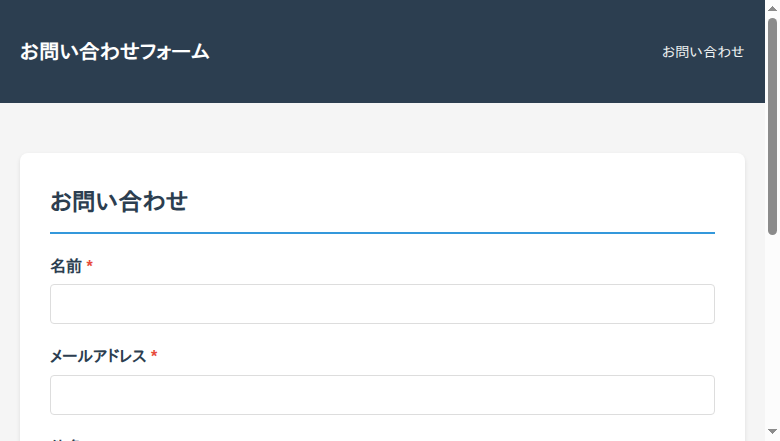

---

#### BT-1-2 必須マーク表示

| 項目 | 内容 |
|------|------|
| 操作手順 | 入力画面を確認する |
| 期待結果 | 各項目に必須マーク（*）が表示されている |
| 結果 | OK / NG |
| 備考 | |

**スクリーンショット:**

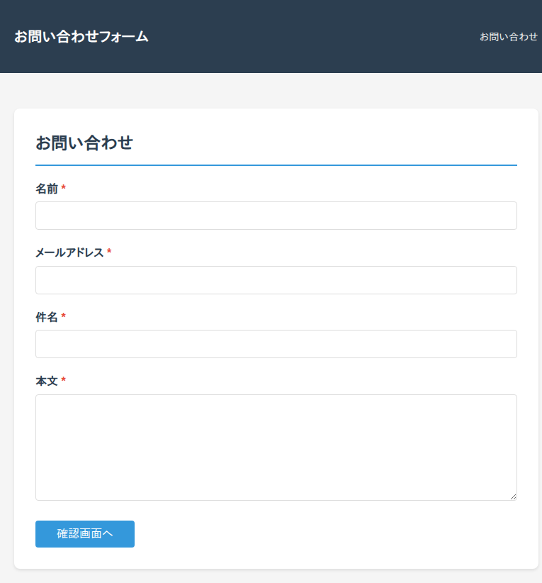

---

### BT-2 バリデーション（必須チェック）

#### BT-2-1 全項目未入力

| 項目 | 内容 |
|------|------|
| 操作手順 | すべて空欄のまま「確認画面へ」を押す |
| 期待結果 | 全項目にエラーメッセージが表示される |
| 結果 | OK / NG |
| 備考 | |

**スクリーンショット:**

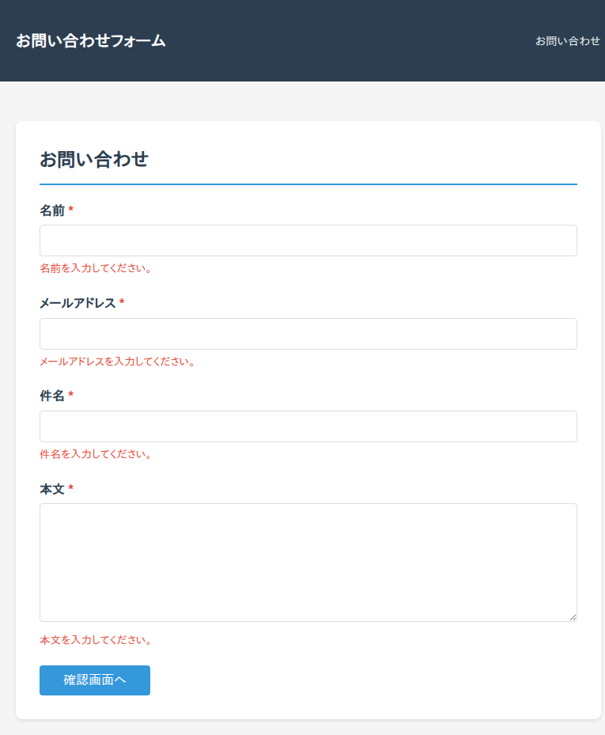

---

#### BT-2-2 名前未入力

| 項目 | 内容 |
|------|------|
| 操作手順 | 名前のみ空欄で他を入力し送信する |
| 期待結果 | 「名前を入力してください。」と表示される |
| 結果 | OK / NG |
| 備考 | |

**スクリーンショット:**

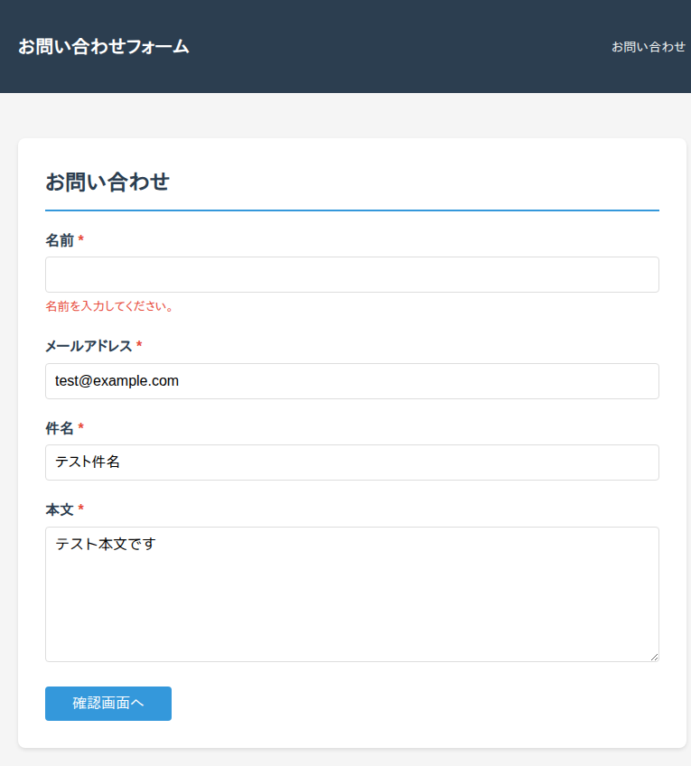

---

#### BT-2-3 メールアドレス未入力

| 項目 | 内容 |
|------|------|
| 操作手順 | メールアドレスのみ空欄で他を入力し送信する |
| 期待結果 | 「メールアドレスを入力してください。」と表示される |
| 結果 | OK / NG |
| 備考 | |

**スクリーンショット:**

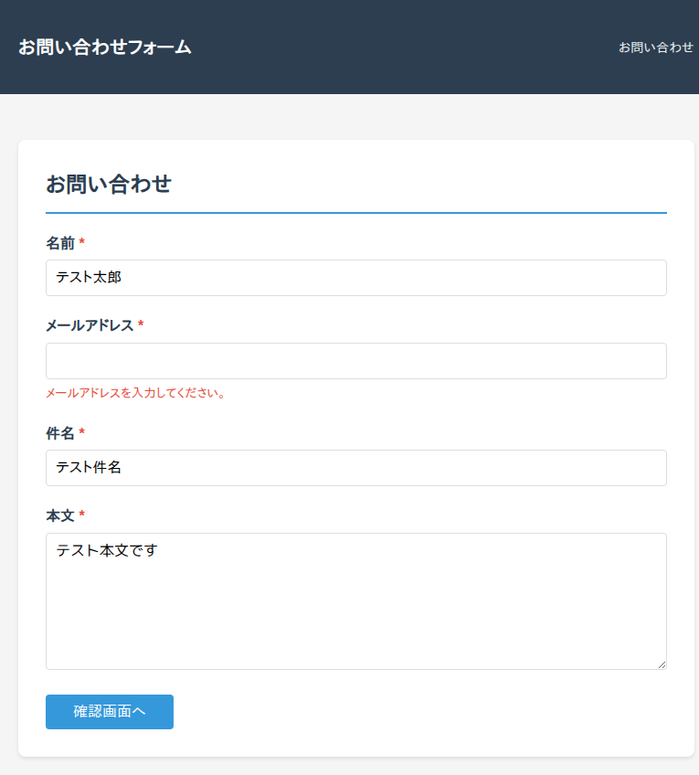

---

#### BT-2-4 件名未入力

| 項目 | 内容 |
|------|------|
| 操作手順 | 件名のみ空欄で他を入力し送信する |
| 期待結果 | 「件名を入力してください。」と表示される |
| 結果 | OK / NG |
| 備考 | |

**スクリーンショット:**

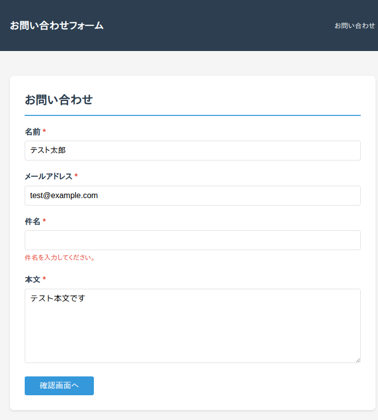

---

#### BT-2-5 本文未入力

| 項目 | 内容 |
|------|------|
| 操作手順 | 本文のみ空欄で他を入力し送信する |
| 期待結果 | 「本文を入力してください。」と表示される |
| 結果 | OK / NG |
| 備考 | |

**スクリーンショット:**

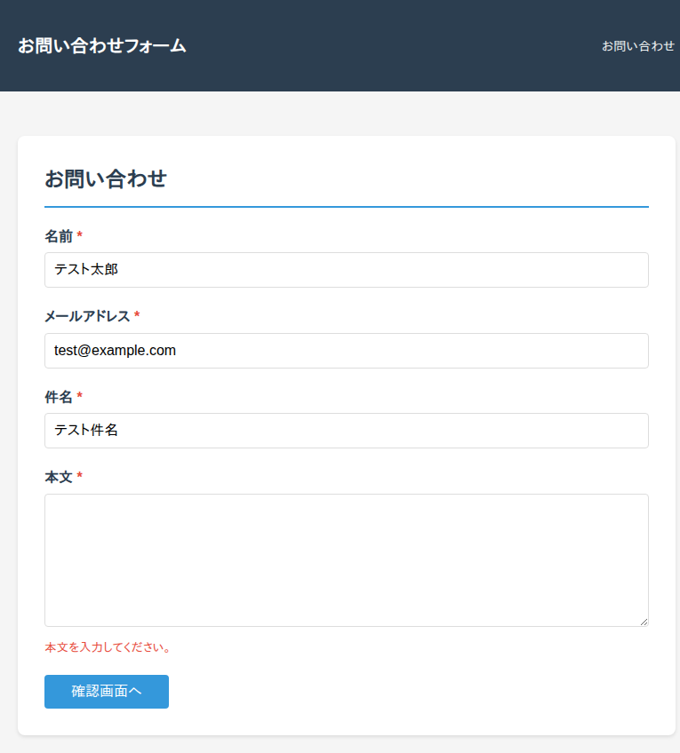

---

### BT-3 バリデーション（形式チェック）

#### BT-3-1 メールアドレス形式不正

| 項目 | 内容 |
|------|------|
| 操作手順 | メールアドレスに `abc` を入力して送信する |
| 期待結果 | 「正しいメールアドレスの形式で入力してください。」と表示される |
| 結果 | OK / NG |
| 備考 | |

**スクリーンショット:**

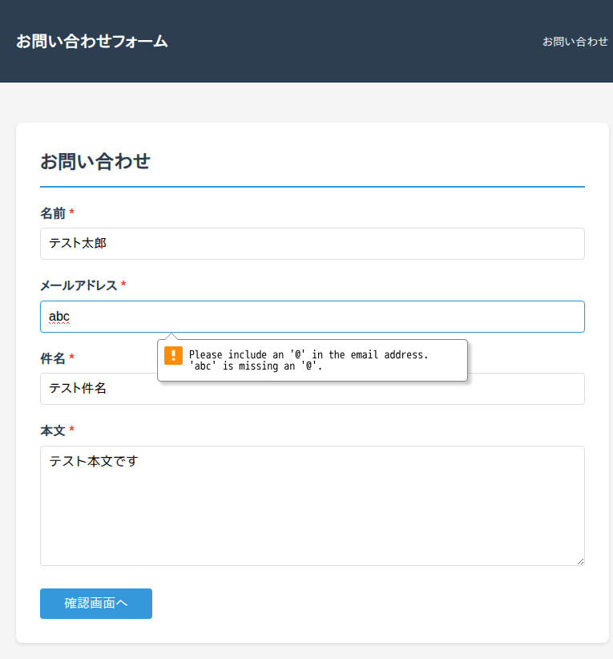

---

#### BT-3-2 メールアドレス形式不正（@なし）

| 項目 | 内容 |
|------|------|
| 操作手順 | メールアドレスに `test.example.com` を入力して送信する |
| 期待結果 | 形式エラーが表示される |
| 結果 | OK / NG |
| 備考 | |

**スクリーンショット:**

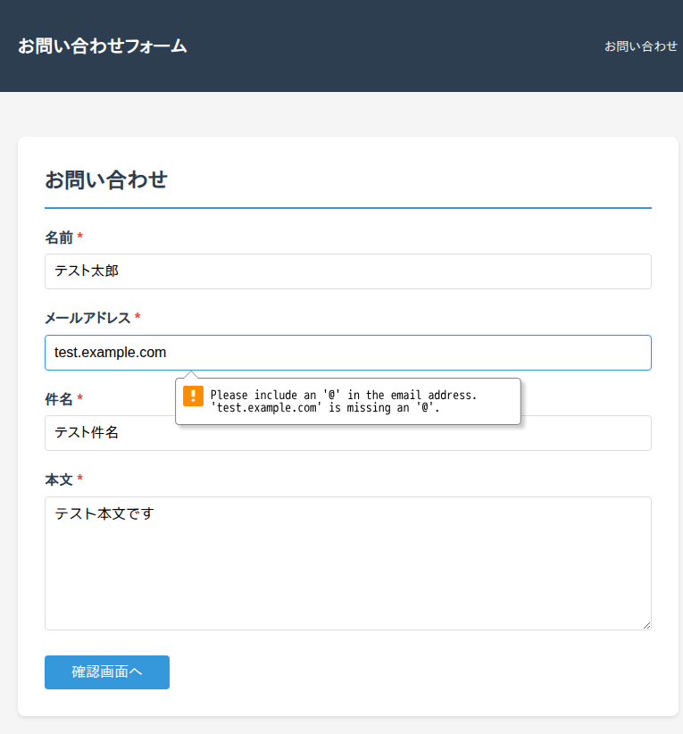

---

#### BT-3-3 メールアドレス正常形式

| 項目 | 内容 |
|------|------|
| 操作手順 | メールアドレスに `test@example.com` を入力して送信する |
| 期待結果 | メールアドレスのバリデーションエラーが出ない |
| 結果 | OK / NG |
| 備考 | |

**スクリーンショット:**

---

### BT-4 バリデーション（文字数チェック）

#### BT-4-1 名前255文字

| 項目 | 内容 |
|------|------|
| 操作手順 | 名前に255文字を入力して送信する |
| 期待結果 | エラーなく確認画面に遷移する |
| 結果 | OK / NG |
| 備考 | |

**スクリーンショット:**

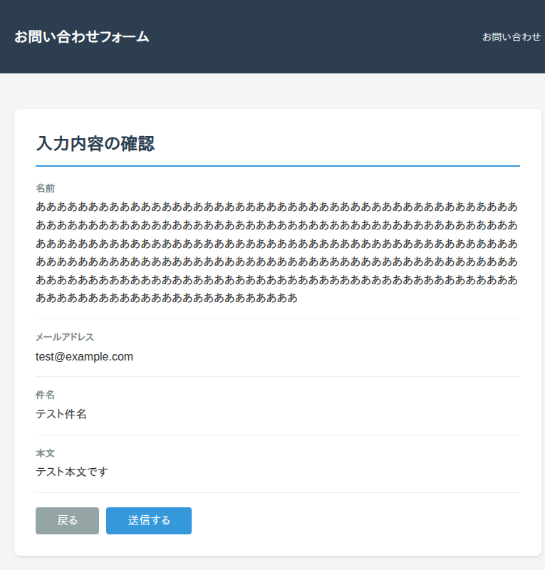

---

#### BT-4-2 名前256文字

| 項目 | 内容 |
|------|------|
| 操作手順 | 名前に256文字を入力して送信する |
| 期待結果 | 「名前は255文字以内で入力してください。」と表示される |
| 結果 | OK / NG |
| 備考 | |

**スクリーンショット:**

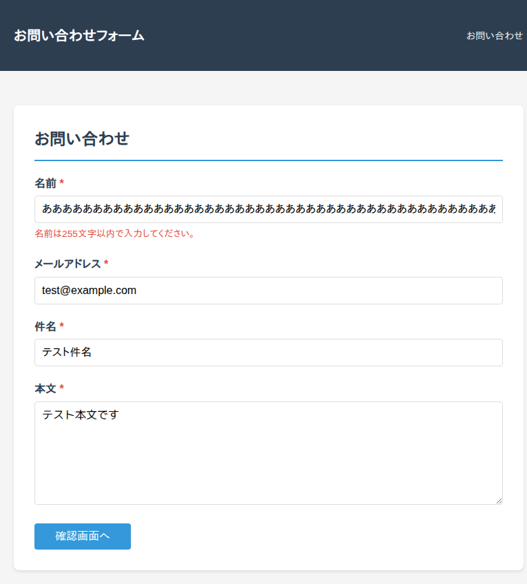

---

#### BT-4-3 メールアドレス255文字

| 項目 | 内容 |
|------|------|
| 操作手順 | メールアドレスに255文字を入力して送信する |
| 期待結果 | エラーなく確認画面に遷移する |
| 結果 | OK / NG |
| 備考 | |

**スクリーンショット:**

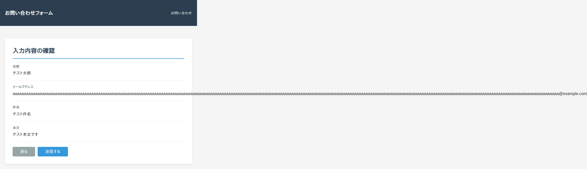

---

#### BT-4-4 メールアドレス256文字

| 項目 | 内容 |
|------|------|
| 操作手順 | メールアドレスに256文字を入力して送信する |
| 期待結果 | 「メールアドレスは255文字以内で入力してください。」と表示される |
| 結果 | OK / NG |
| 備考 | |

**スクリーンショット:**

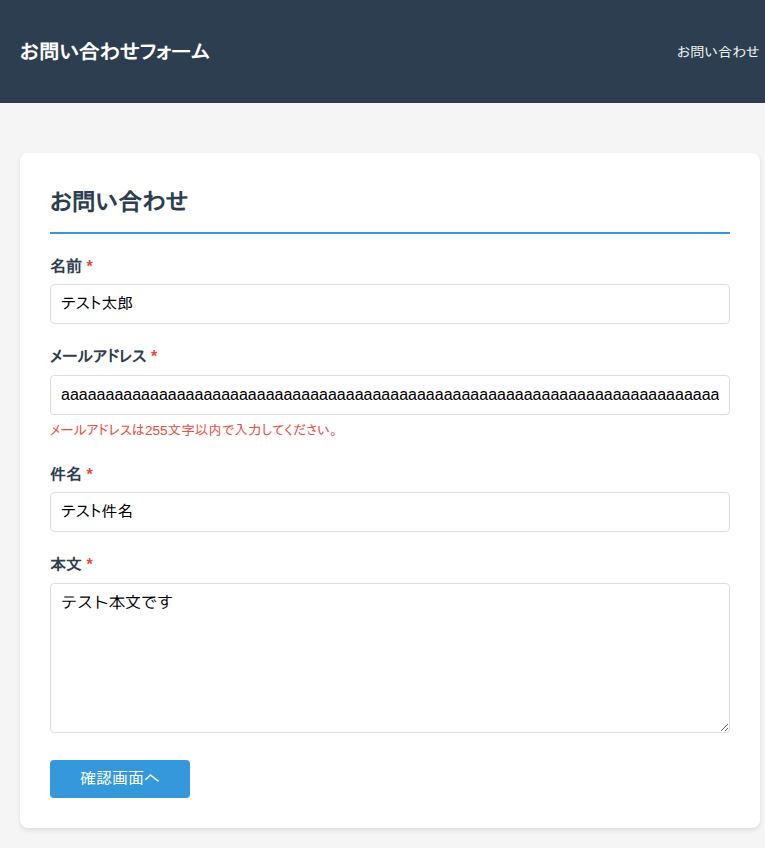

---

#### BT-4-5 件名255文字

| 項目 | 内容 |
|------|------|
| 操作手順 | 件名に255文字を入力して送信する |
| 期待結果 | エラーなく確認画面に遷移する |
| 結果 | OK / NG |
| 備考 | |

**スクリーンショット:**

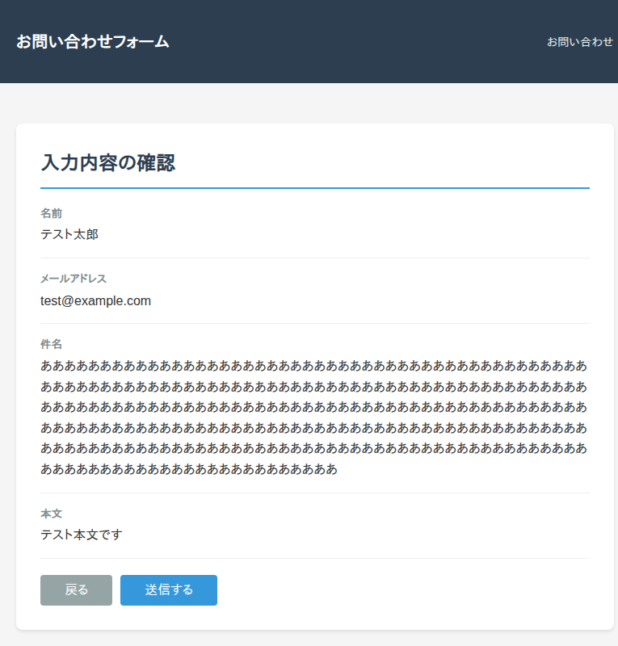

---

#### BT-4-6 件名256文字

| 項目 | 内容 |
|------|------|
| 操作手順 | 件名に256文字を入力して送信する |
| 期待結果 | 「件名は255文字以内で入力してください。」と表示される |
| 結果 | OK / NG |
| 備考 | |

**スクリーンショット:**

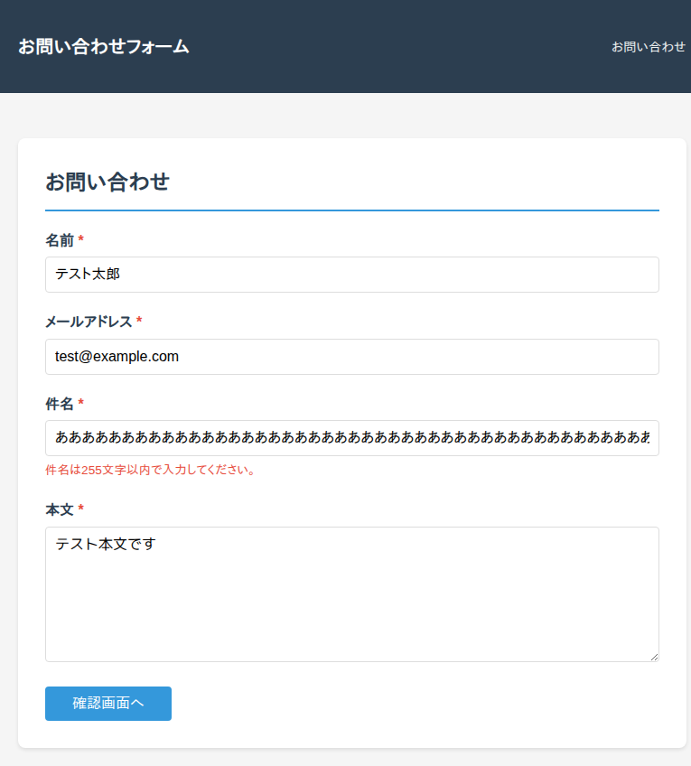

---

### BT-5 バリデーション（入力値の復元）

#### BT-5-1 エラー後の入力値復元

| 項目 | 内容 |
|------|------|
| 操作手順 | 名前のみ空欄で送信する |
| 期待結果 | 名前以外の入力値が入力欄に復元されている |
| 結果 | OK / NG |
| 備考 | |

**スクリーンショット:**

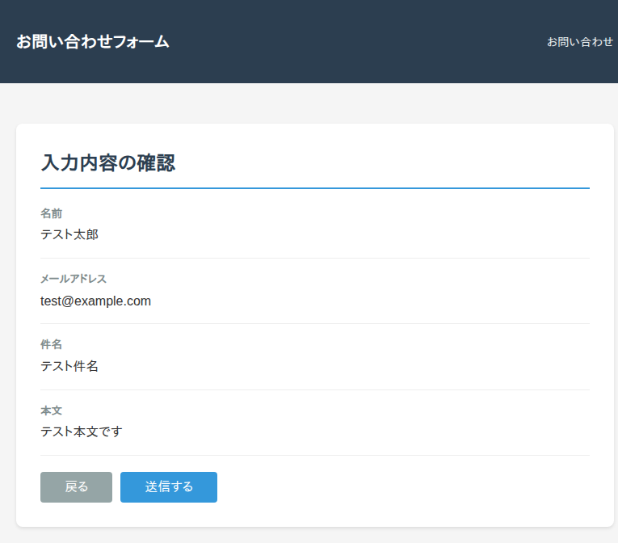

---

### BT-6 確認画面

#### BT-6-1 確認画面表示

| 項目 | 内容 |
|------|------|
| 操作手順 | 全項目を正しく入力して「確認画面へ」を押す |
| 期待結果 | 確認画面に入力内容が表示される |
| 結果 | OK / NG |
| 備考 | |

**スクリーンショット:**

---

#### BT-6-2 名前の表示

| 項目 | 内容 |
|------|------|
| 操作手順 | 確認画面で名前の表示を確認する |
| 期待結果 | 入力した名前が正しく表示されている |
| 結果 | OK / NG |
| 備考 | |

**スクリーンショット:**

---

#### BT-6-3 メールアドレスの表示

| 項目 | 内容 |
|------|------|
| 操作手順 | 確認画面でメールアドレスの表示を確認する |
| 期待結果 | 入力したメールアドレスが正しく表示されている |
| 結果 | OK / NG |
| 備考 | |

**スクリーンショット:**

---

#### BT-6-4 件名の表示

| 項目 | 内容 |
|------|------|
| 操作手順 | 確認画面で件名の表示を確認する |
| 期待結果 | 入力した件名が正しく表示されている |
| 結果 | OK / NG |
| 備考 | |

**スクリーンショット:**

---

#### BT-6-5 本文の表示

| 項目 | 内容 |
|------|------|
| 操作手順 | 確認画面で本文の表示を確認する |
| 期待結果 | 入力した本文が正しく表示されている |
| 結果 | OK / NG |
| 備考 | |

**スクリーンショット:**

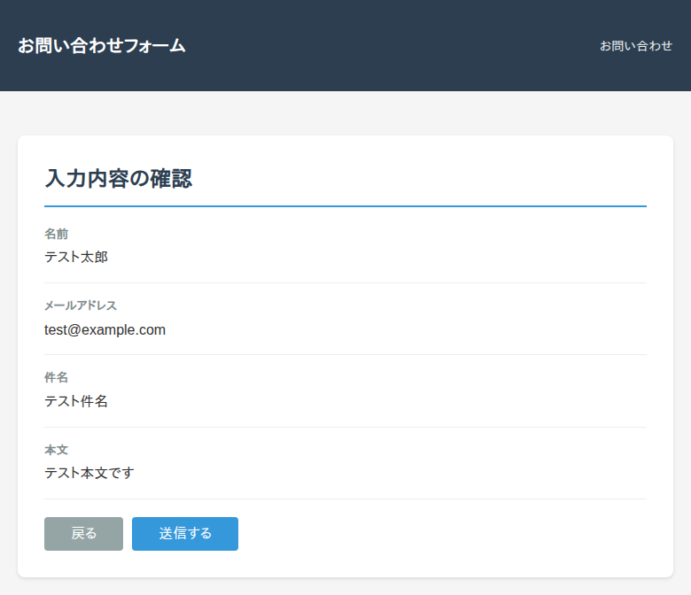

---

#### BT-6-6 本文の改行保持

| 項目 | 内容 |
|------|------|
| 操作手順 | 本文に改行を含む文章を入力して確認画面を表示する |
| 期待結果 | 改行が反映された状態で表示される |
| 結果 | OK / NG |
| 備考 | |

**スクリーンショット:**

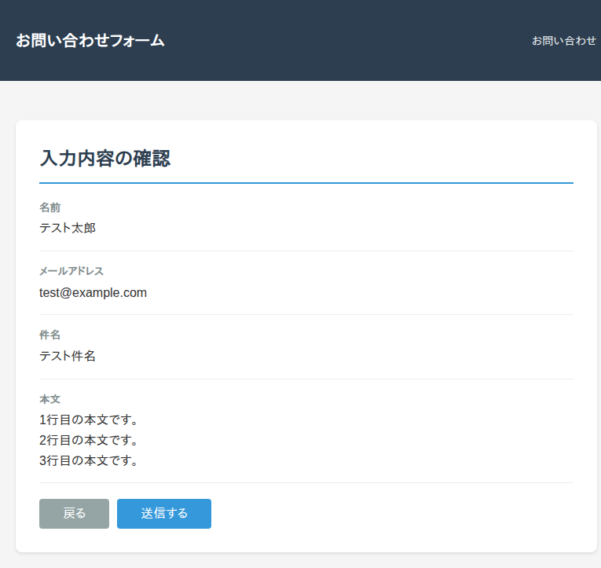

---

#### BT-6-7 HTMLエスケープ

| 項目 | 内容 |
|------|------|
| 操作手順 | 名前に `` を入力して確認画面を表示する |
| 期待結果 | HTMLタグがエスケープされ、スクリプトが実行されない |
| 結果 | OK / NG |
| 備考 | |

**スクリーンショット:**

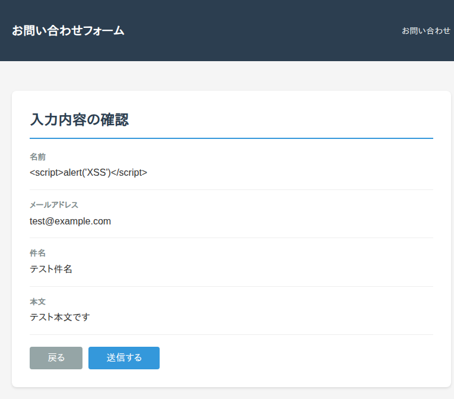

---

#### BT-6-8 「戻る」ボタン

| 項目 | 内容 |
|------|------|
| 操作手順 | 確認画面で「戻る」ボタンを押す |
| 期待結果 | 入力画面に戻り、入力内容が復元されている |
| 結果 | OK / NG |
| 備考 | |

**スクリーンショット:**

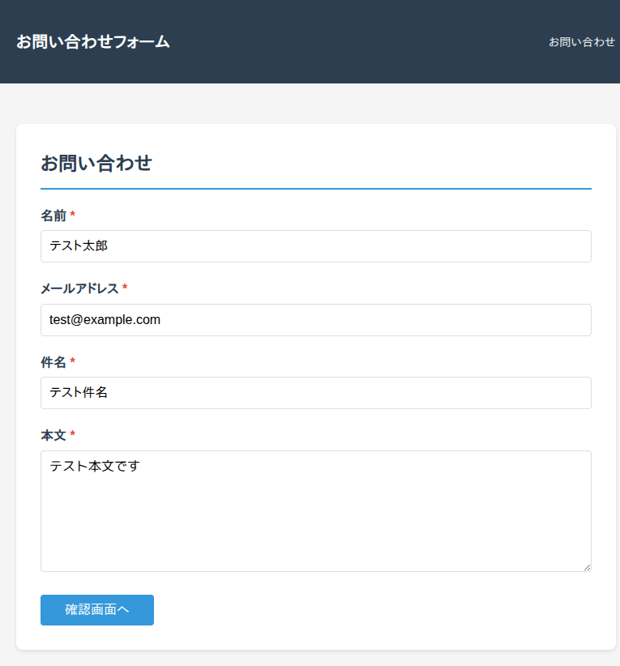

---

#### BT-6-9 「送信する」ボタン

| 項目 | 内容 |
|------|------|
| 操作手順 | 確認画面で「送信する」ボタンを押す |
| 期待結果 | 送信処理が実行され、完了画面にリダイレクトされる |
| 結果 | OK / NG |
| 備考 | |

**スクリーンショット:**

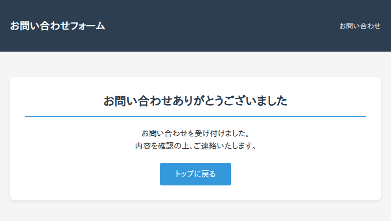

---

### BT-7 送信処理・完了画面

#### BT-7-1 完了画面表示

| 項目 | 内容 |
|------|------|
| 操作手順 | 確認画面から送信する |
| 期待結果 | 「お問い合わせありがとうございました」と表示される |
| 結果 | OK / NG |
| 備考 | |

**スクリーンショット:**

---

#### BT-7-2 フォームへのリンク

| 項目 | 内容 |
|------|------|
| 操作手順 | 完了画面を確認する |
| 期待結果 | お問い合わせフォームへのリンクが表示されている |
| 結果 | OK / NG |
| 備考 | |

**スクリーンショット:**

---

#### BT-7-3 セッションのクリア

| 項目 | 内容 |
|------|------|
| 操作手順 | 送信完了後にブラウザの戻るボタンで確認画面に戻ろうとする |
| 期待結果 | セッションデータがクリアされており、確認画面が再表示されない |
| 結果 | OK / NG |
| 備考 | |

**スクリーンショット:**

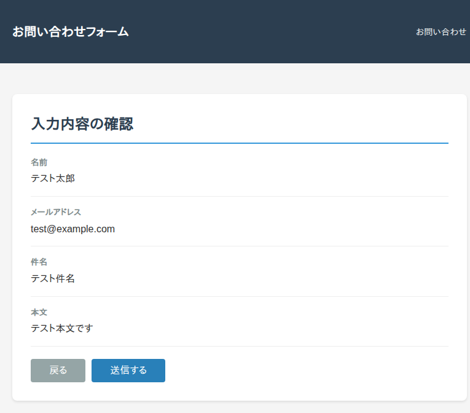

---

### BT-8 不正アクセス

#### BT-8-1 完了画面への直接アクセス

| 項目 | 内容 |
|------|------|
| 操作手順 | ブラウザで `/contact/thanks` に直接アクセスする |
| 期待結果 | 完了画面が表示される（エラーにならない） |
| 結果 | OK / NG |
| 備考 | |

**スクリーンショット:**

---

## 2. 管理ページ側

### BT-9 ログイン画面

#### BT-9-1 ログイン画面表示

| 項目 | 内容 |
|------|------|
| 操作手順 | `/admin/login` にアクセスする |
| 期待結果 | パスワード入力欄とログインボタンが表示される |
| 結果 | OK / NG |
| 備考 | |

**スクリーンショット:**

---

#### BT-9-2 正しいパスワードでログイン

| 項目 | 内容 |
|------|------|
| 操作手順 | 正しいパスワードを入力してログインする |
| 期待結果 | 管理画面（お問い合わせ一覧）にリダイレクトされる |
| 結果 | OK / NG |
| 備考 | |

**スクリーンショット:**

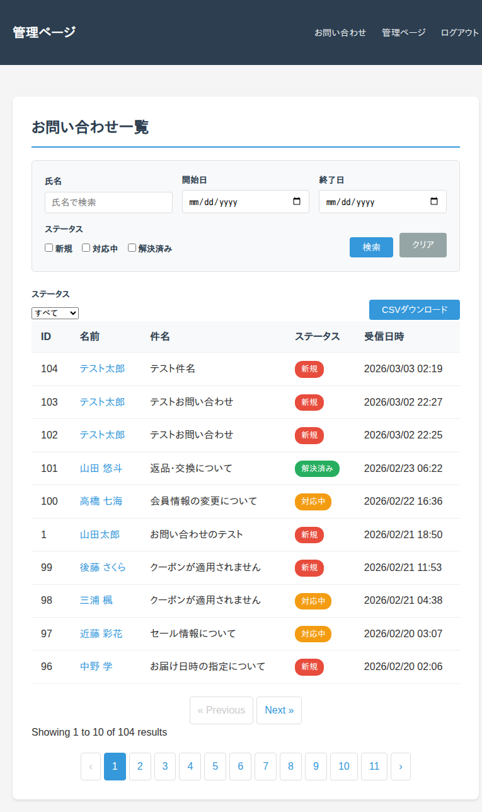

---

#### BT-9-3 誤ったパスワードでログイン

| 項目 | 内容 |
|------|------|
| 操作手順 | 誤ったパスワードを入力してログインする |
| 期待結果 | エラーメッセージが表示され、ログイン画面に戻る |
| 結果 | OK / NG |
| 備考 | |

**スクリーンショット:**

---

#### BT-9-4 パスワード未入力でログイン

| 項目 | 内容 |
|------|------|
| 操作手順 | パスワードを空欄のまま送信する |
| 期待結果 | バリデーションエラーが表示される |
| 結果 | OK / NG |
| 備考 | |

**スクリーンショット:**

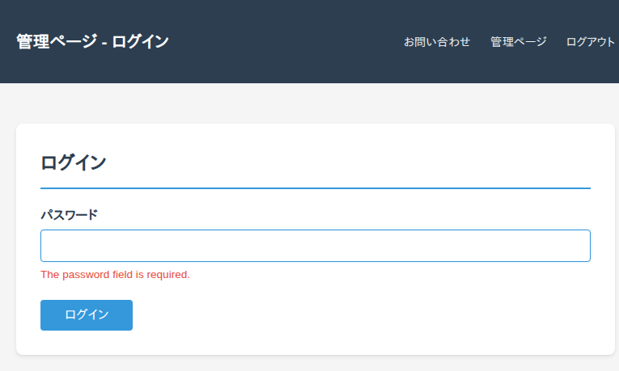

---

### BT-10 認証・アクセス制御

#### BT-10-1 未ログインで一覧にアクセス

| 項目 | 内容 |
|------|------|
| 操作手順 | ログインせずに `/admin/contacts` にアクセスする |
| 期待結果 | ログイン画面にリダイレクトされる |
| 結果 | OK / NG |
| 備考 | |

**スクリーンショット:**

---

#### BT-10-2 未ログインで詳細にアクセス

| 項目 | 内容 |
|------|------|
| 操作手順 | ログインせずに `/admin/contacts/1` にアクセスする |
| 期待結果 | ログイン画面にリダイレクトされる |
| 結果 | OK / NG |
| 備考 | |

**スクリーンショット:**

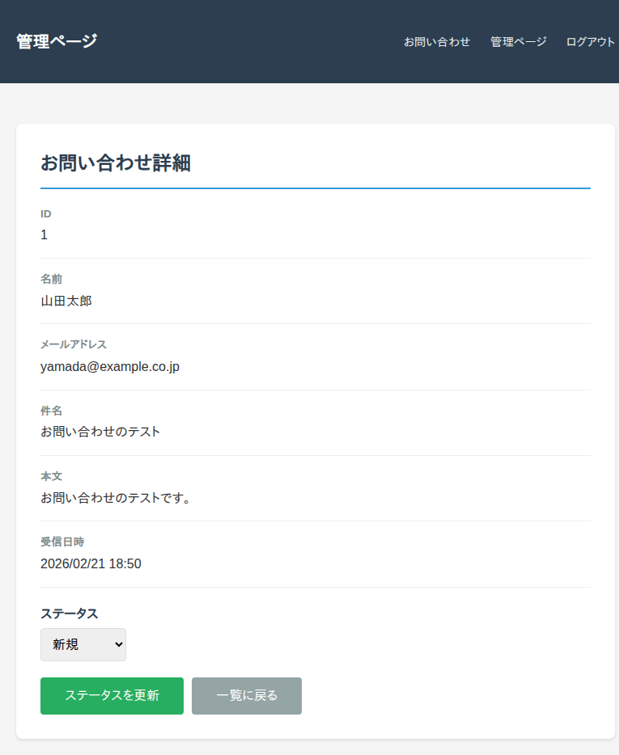

---

#### BT-10-3 ログアウト

| 項目 | 内容 |
|------|------|
| 操作手順 | ログイン後にログアウトボタンを押す |
| 期待結果 | ログイン画面にリダイレクトされる |
| 結果 | OK / NG |
| 備考 | |

**スクリーンショット:**

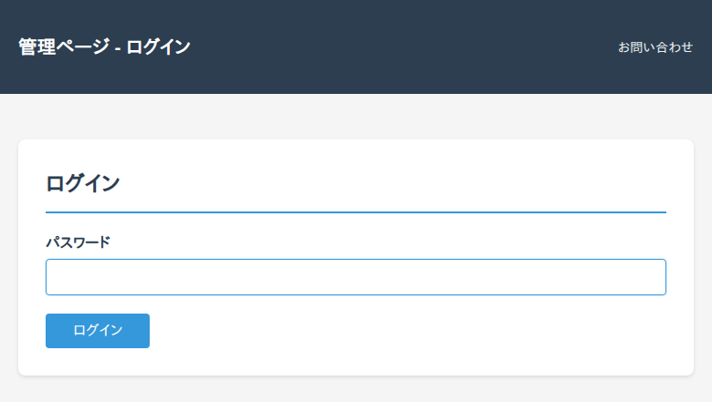

---

#### BT-10-4 ログアウト後のアクセス

| 項目 | 内容 |
|------|------|
| 操作手順 | ログアウト後に `/admin/contacts` にアクセスする |
| 期待結果 | ログイン画面にリダイレクトされる |
| 結果 | OK / NG |
| 備考 | |

**スクリーンショット:**

---

### BT-11 お問い合わせ一覧表示

#### BT-11-1 一覧画面表示

| 項目 | 内容 |
|------|------|
| 操作手順 | ログイン後に一覧画面を開く |
| 期待結果 | お問い合わせ一覧が表示される |
| 結果 | OK / NG |
| 備考 | |

**スクリーンショット:**

---

#### BT-11-2 表示項目の確認

| 項目 | 内容 |
|------|------|
| 操作手順 | 一覧の表示項目を確認する |
| 期待結果 | ID・名前・件名・ステータス・受信日時が表示されている |
| 結果 | OK / NG |
| 備考 | |

**スクリーンショット:**

---

#### BT-11-3 ステータスバッジの色（新規）

| 項目 | 内容 |
|------|------|
| 操作手順 | ステータスが「新規」のレコードを確認する |
| 期待結果 | 赤色のバッジで表示される |
| 結果 | OK / NG |
| 備考 | |

**スクリーンショット:**

---

#### BT-11-4 ステータスバッジの色（対応中）

| 項目 | 内容 |
|------|------|
| 操作手順 | ステータスが「対応中」のレコードを確認する |
| 期待結果 | オレンジ色のバッジで表示される |
| 結果 | OK / NG |
| 備考 | |

**スクリーンショット:**

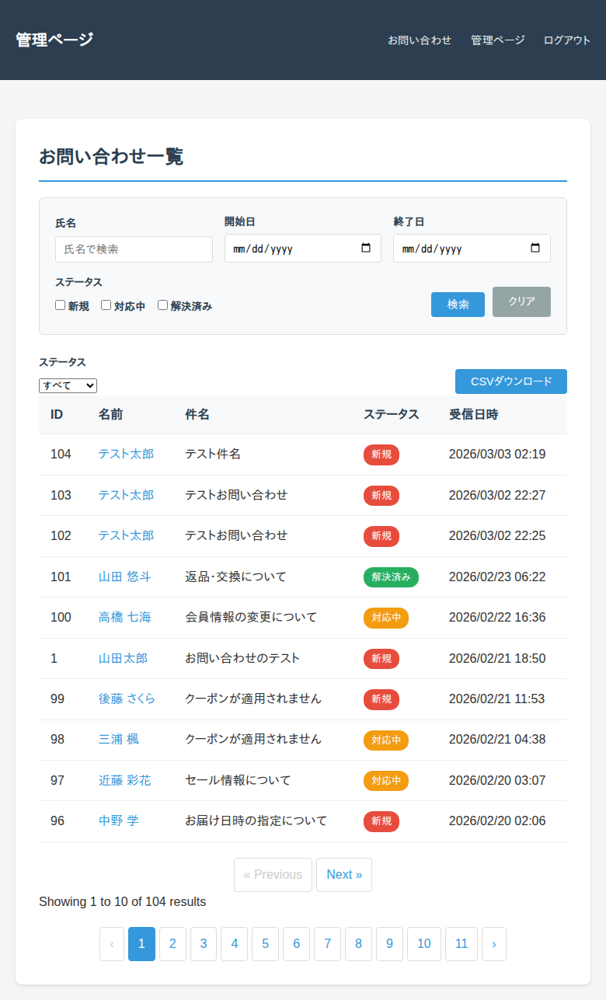

---

#### BT-11-5 ステータスバッジの色（解決済み）

| 項目 | 内容 |
|------|------|
| 操作手順 | ステータスが「解決済み」のレコードを確認する |
| 期待結果 | 緑色のバッジで表示される |
| 結果 | OK / NG |
| 備考 | |

**スクリーンショット:**

---

#### BT-11-6 詳細へのリンク

| 項目 | 内容 |
|------|------|
| 操作手順 | 一覧の名前をクリックする |
| 期待結果 | 該当のお問い合わせ詳細画面に遷移する |
| 結果 | OK / NG |
| 備考 | |

**スクリーンショット:**

---

#### BT-11-7 データなしの場合

| 項目 | 内容 |
|------|------|
| 操作手順 | お問い合わせが0件の状態で一覧を表示する |
| 期待結果 | データがない旨が適切に表示される（エラーにならない） |
| 結果 | OK / NG |
| 備考 | |

**スクリーンショット:**

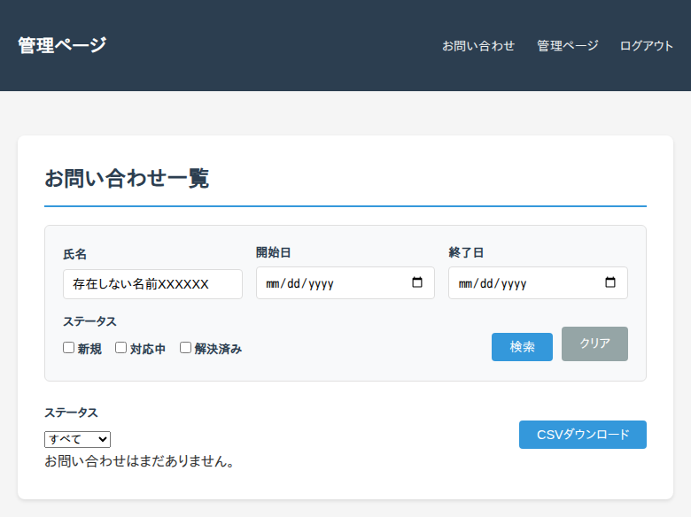

---

### BT-12 ページネーション

#### BT-12-1 ページネーション表示

| 項目 | 内容 |
|------|------|
| 操作手順 | 11件以上のデータがある状態で一覧を表示する |
| 期待結果 | ページネーションリンクが表示される |
| 結果 | OK / NG |
| 備考 | |

**スクリーンショット:**

---

#### BT-12-2 1ページあたりの表示件数

| 項目 | 内容 |
|------|------|
| 操作手順 | 一覧画面の表示件数を確認する |
| 期待結果 | 1ページに10件表示される |
| 結果 | OK / NG |
| 備考 | |

**スクリーンショット:**

---

#### BT-12-3 2ページ目への遷移

| 項目 | 内容 |
|------|------|
| 操作手順 | ページネーションの2ページ目をクリックする |
| 期待結果 | 2ページ目のデータが表示される |
| 結果 | OK / NG |
| 備考 | |

**スクリーンショット:**

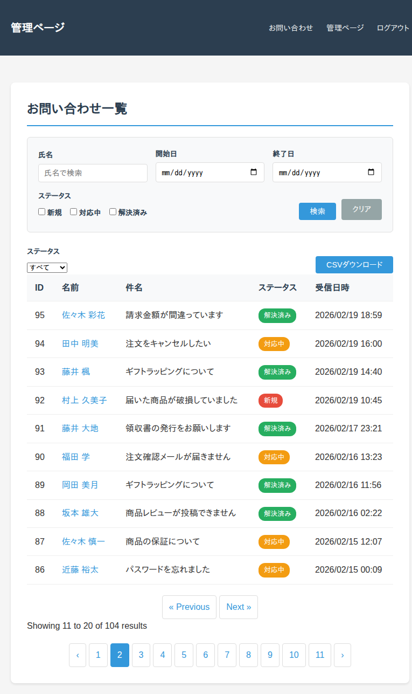

---

#### BT-12-4 検索条件の保持

| 項目 | 内容 |
|------|------|
| 操作手順 | 検索実行後にページネーションで2ページ目に遷移する |
| 期待結果 | 検索条件が維持された状態で2ページ目が表示される |
| 結果 | OK / NG |
| 備考 | |

**スクリーンショット:**

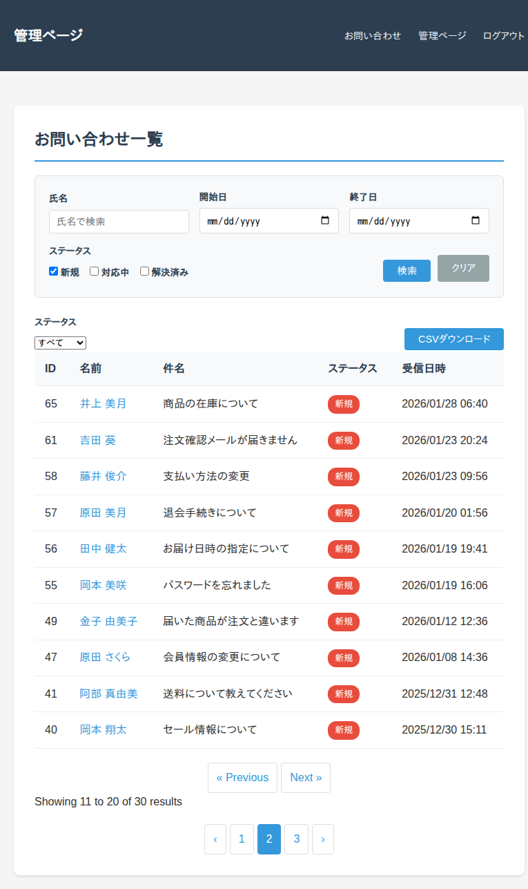

---

### BT-13 検索・フィルタ

#### BT-13-1 名前で検索

| 項目 | 内容 |
|------|------|
| 操作手順 | 名前欄に「田中」と入力して検索する |
| 期待結果 | 名前に「田中」を含むお問い合わせのみ表示される |
| 結果 | OK / NG |
| 備考 | |

**スクリーンショット:**

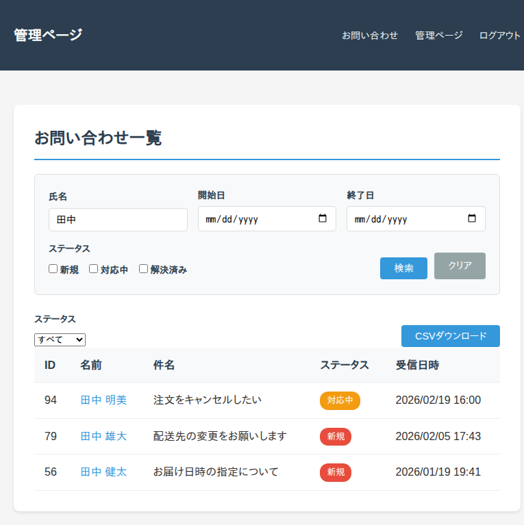

---

#### BT-13-2 名前の部分一致

| 項目 | 内容 |
|------|------|
| 操作手順 | 名前欄に「田」と入力して検索する |
| 期待結果 | 名前に「田」を含むお問い合わせが全て表示される |
| 結果 | OK / NG |
| 備考 | |

**スクリーンショット:**

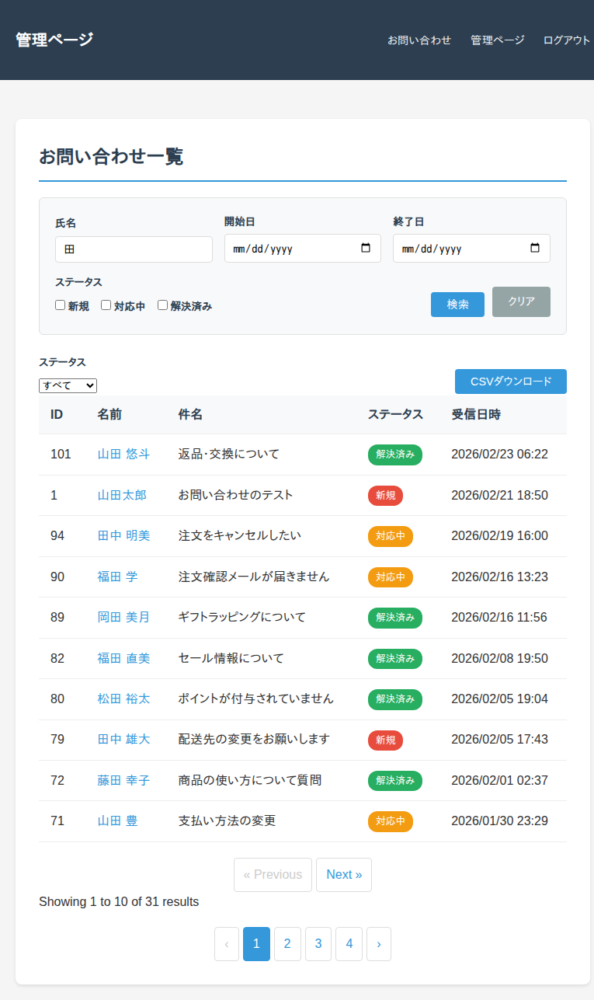

---

#### BT-13-3 日付（開始日）で絞り込み

| 項目 | 内容 |
|------|------|
| 操作手順 | 開始日を指定して検索する |
| 期待結果 | 指定日以降のお問い合わせのみ表示される |
| 結果 | OK / NG |
| 備考 | |

**スクリーンショット:**

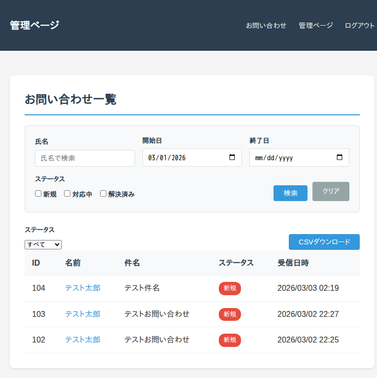

---

#### BT-13-4 日付（終了日）で絞り込み

| 項目 | 内容 |
|------|------|
| 操作手順 | 終了日を指定して検索する |
| 期待結果 | 指定日以前のお問い合わせのみ表示される |
| 結果 | OK / NG |
| 備考 | |

**スクリーンショット:**

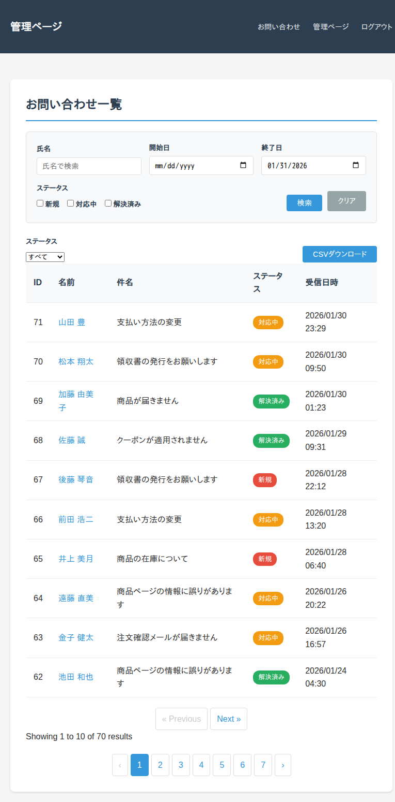

---

#### BT-13-5 日付範囲で絞り込み

| 項目 | 内容 |
|------|------|
| 操作手順 | 開始日と終了日を指定して検索する |
| 期待結果 | 指定期間内のお問い合わせのみ表示される |
| 結果 | OK / NG |
| 備考 | |

**スクリーンショット:**

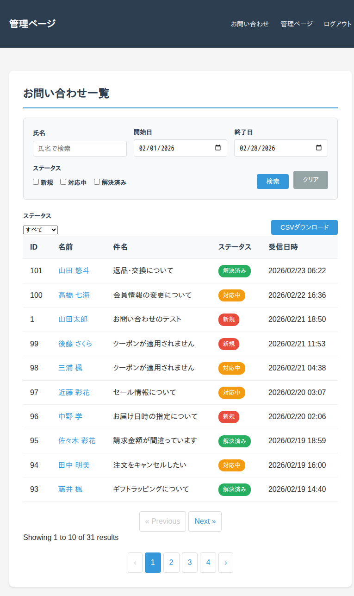

---

#### BT-13-6 ステータスで絞り込み（単一）

| 項目 | 内容 |
|------|------|
| 操作手順 | 「新規」のチェックボックスのみチェックして検索する |
| 期待結果 | ステータスが「新規」のお問い合わせのみ表示される |
| 結果 | OK / NG |
| 備考 | |

**スクリーンショット:**

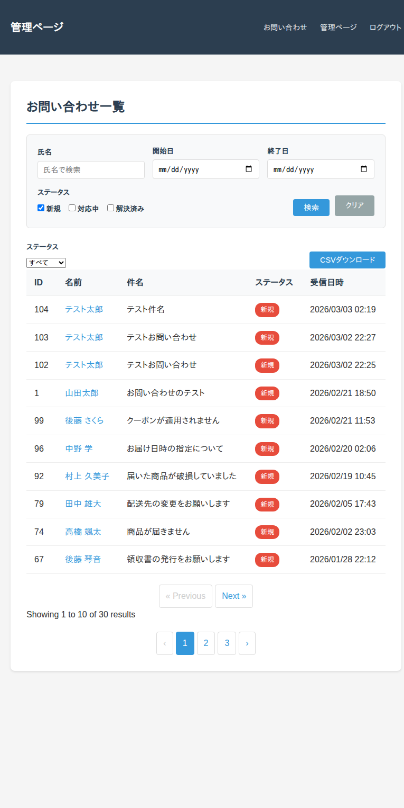

---

#### BT-13-7 ステータスで絞り込み（複数）

| 項目 | 内容 |
|------|------|
| 操作手順 | 「新規」と「対応中」をチェックして検索する |
| 期待結果 | ステータスが「新規」または「対応中」のお問い合わせが表示される |
| 結果 | OK / NG |
| 備考 | |

**スクリーンショット:**

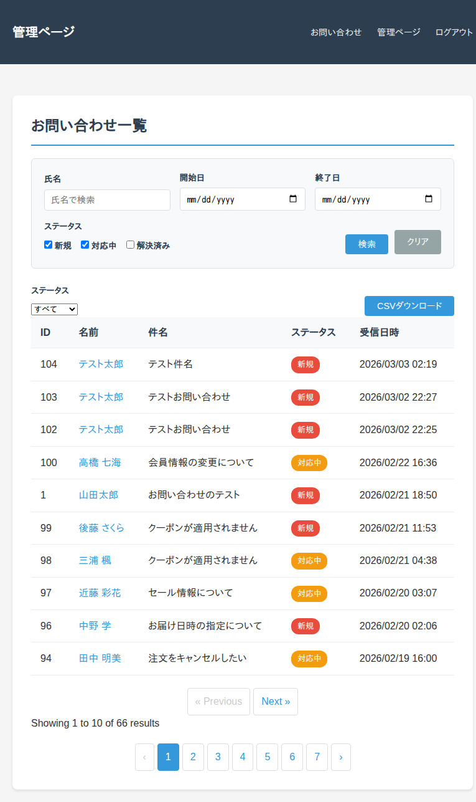

---

#### BT-13-8 複合検索

| 項目 | 内容 |
|------|------|
| 操作手順 | 名前・日付・ステータスを組み合わせて検索する |
| 期待結果 | すべての条件を満たすお問い合わせのみ表示される |
| 結果 | OK / NG |
| 備考 | |

**スクリーンショット:**

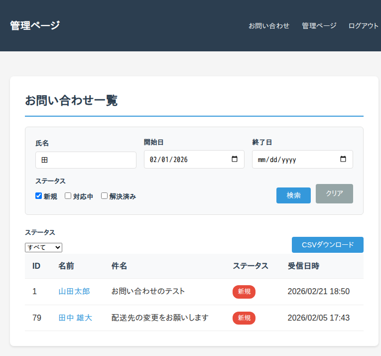

---

#### BT-13-9 検索条件クリア

| 項目 | 内容 |
|------|------|
| 操作手順 | 検索条件を入力後「クリア」ボタンを押す |
| 期待結果 | 検索条件がリセットされ、全件が表示される |
| 結果 | OK / NG |
| 備考 | |

**スクリーンショット:**

---

#### BT-13-10 該当なしの検索

| 項目 | 内容 |
|------|------|
| 操作手順 | 存在しない名前で検索する |
| 期待結果 | 検索結果が0件であることが表示される（エラーにならない） |
| 結果 | OK / NG |
| 備考 | |

**スクリーンショット:**

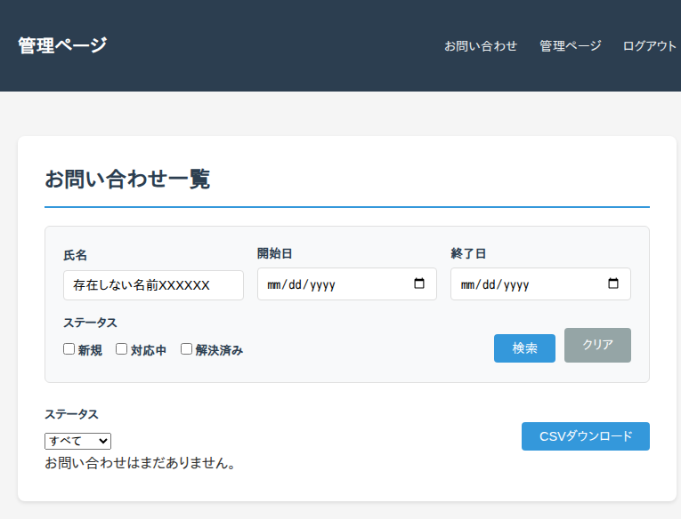

---

### BT-14 お問い合わせ詳細

#### BT-14-1 詳細画面表示

| 項目 | 内容 |
|------|------|
| 操作手順 | 一覧から任意のお問い合わせをクリックする |
| 期待結果 | 詳細画面が表示される |
| 結果 | OK / NG |
| 備考 | |

**スクリーンショット:**

---

#### BT-14-2 表示項目の確認

| 項目 | 内容 |
|------|------|
| 操作手順 | 詳細画面の表示項目を確認する |
| 期待結果 | ID・名前・メールアドレス・件名・本文・受信日時が表示されている |
| 結果 | OK / NG |
| 備考 | |

**スクリーンショット:**

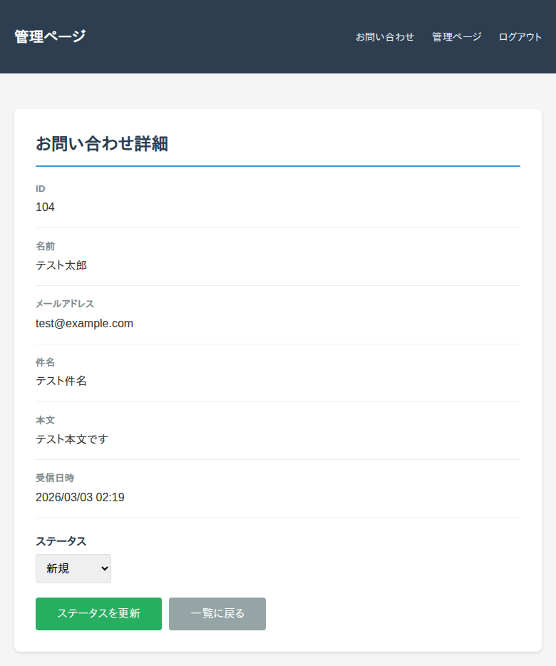

---

#### BT-14-3 本文の改行表示

| 項目 | 内容 |
|------|------|
| 操作手順 | 改行を含む本文のお問い合わせを表示する |
| 期待結果 | 改行が反映された状態で表示される |
| 結果 | OK / NG |
| 備考 | |

**スクリーンショット:**

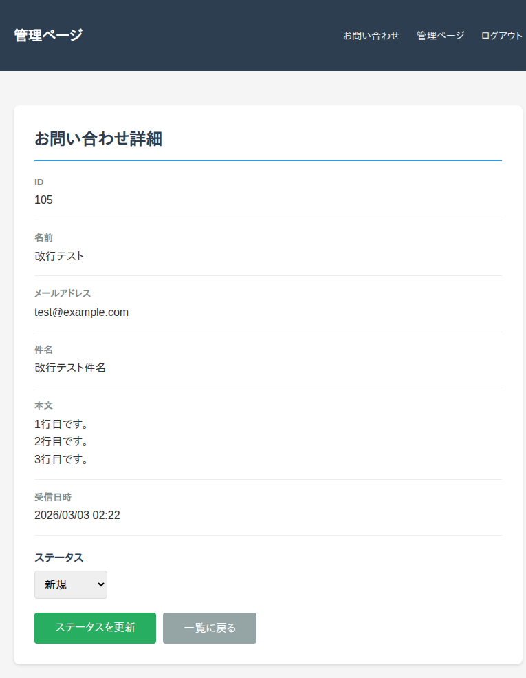

---

#### BT-14-4 HTMLエスケープ

| 項目 | 内容 |
|------|------|
| 操作手順 | HTMLタグを含む本文のお問い合わせを表示する |
| 期待結果 | HTMLタグがエスケープされ、スクリプトが実行されない |
| 結果 | OK / NG |
| 備考 | |

**スクリーンショット:**

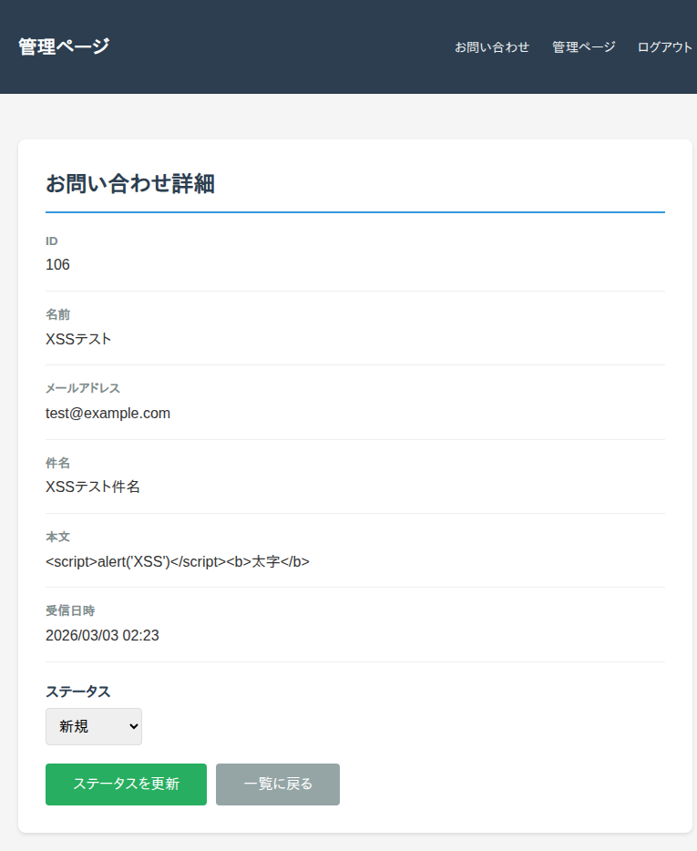

---

#### BT-14-5 ステータスドロップダウン

| 項目 | 内容 |
|------|------|
| 操作手順 | 詳細画面のステータス欄を確認する |
| 期待結果 | ドロップダウンに「新規」「対応中」「解決済み」が表示される |
| 結果 | OK / NG |
| 備考 | |

**スクリーンショット:**

---

#### BT-14-6 現在のステータスが選択状態

| 項目 | 内容 |
|------|------|
| 操作手順 | ステータスが「対応中」のお問い合わせの詳細を開く |
| 期待結果 | ドロップダウンで「対応中」が選択された状態になっている |
| 結果 | OK / NG |
| 備考 | |

**スクリーンショット:**

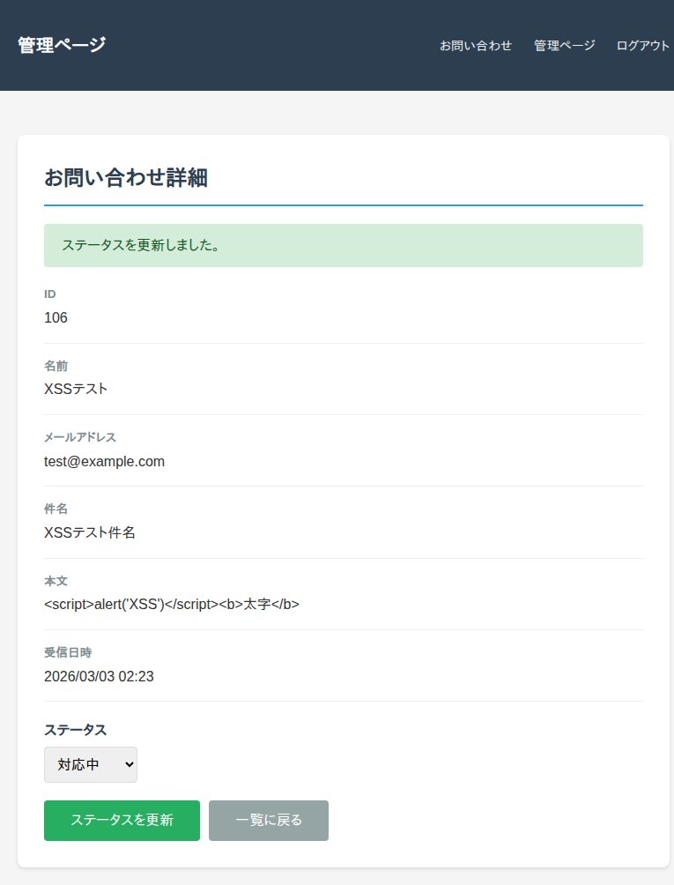

---

#### BT-14-7 「一覧に戻る」リンク

| 項目 | 内容 |
|------|------|
| 操作手順 | 「一覧に戻る」リンクをクリックする |
| 期待結果 | お問い合わせ一覧画面に遷移する |
| 結果 | OK / NG |
| 備考 | |

**スクリーンショット:**

---

#### BT-14-8 存在しないIDへのアクセス

| 項目 | 内容 |
|------|------|
| 操作手順 | ブラウザで存在しないID（例: `/admin/contacts/99999`）にアクセスする |
| 期待結果 | 404エラーが返される |
| 結果 | OK / NG |
| 備考 | |

**スクリーンショット:**

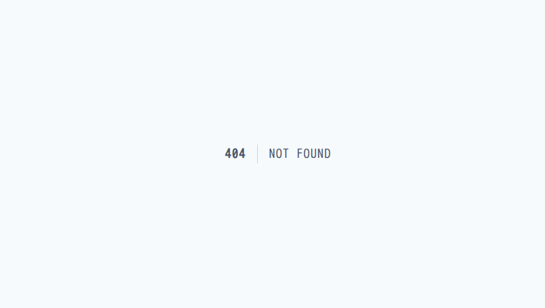

---

### BT-15 ステータス更新

#### BT-15-1 「新規」→「対応中」に変更

| 項目 | 内容 |
|------|------|
| 操作手順 | ステータスを「対応中」に変更して更新ボタンを押す |
| 期待結果 | ステータスが「対応中」に更新され、成功メッセージが表示される |
| 結果 | OK / NG |
| 備考 | |

**スクリーンショット:**

---

#### BT-15-2 「対応中」→「解決済み」に変更

| 項目 | 内容 |
|------|------|
| 操作手順 | ステータスを「解決済み」に変更して更新ボタンを押す |
| 期待結果 | ステータスが「解決済み」に更新され、成功メッセージが表示される |
| 結果 | OK / NG |
| 備考 | |

**スクリーンショット:**

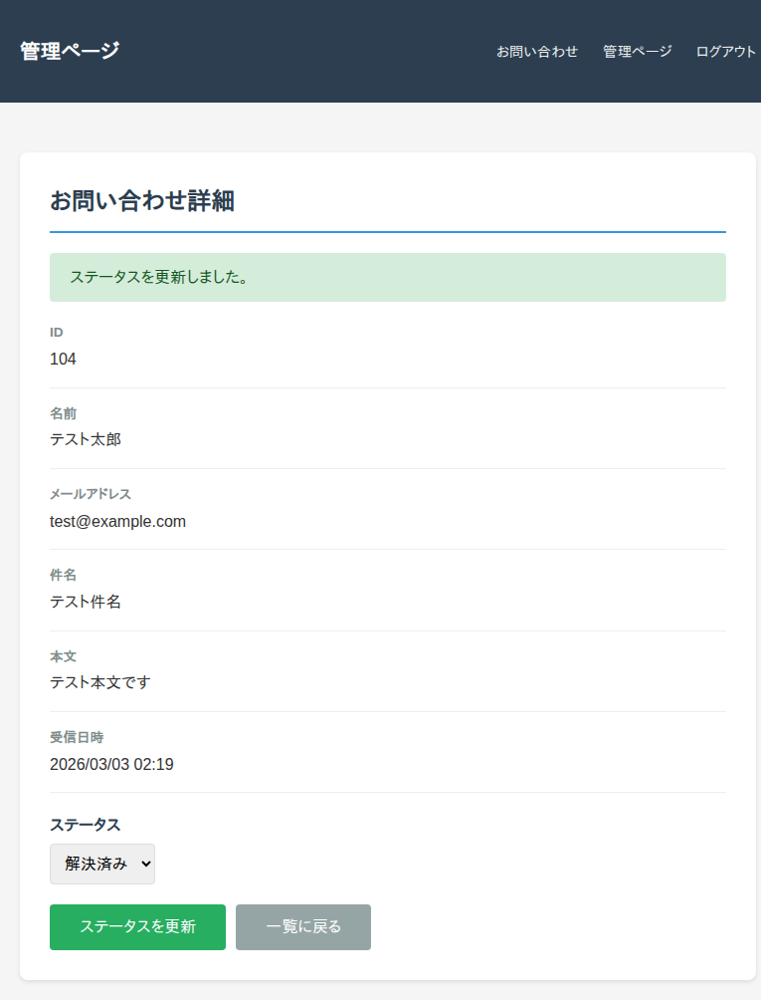

---

#### BT-15-3 「解決済み」→「新規」に変更

| 項目 | 内容 |
|------|------|
| 操作手順 | ステータスを「新規」に変更して更新ボタンを押す |
| 期待結果 | ステータスが「新規」に更新され、成功メッセージが表示される |
| 結果 | OK / NG |
| 備考 | |

**スクリーンショット:**

---

#### BT-15-4 成功メッセージの表示

| 項目 | 内容 |
|------|------|
| 操作手順 | ステータスを更新する |
| 期待結果 | 「ステータスを更新しました。」と表示される |
| 結果 | OK / NG |
| 備考 | |

**スクリーンショット:**

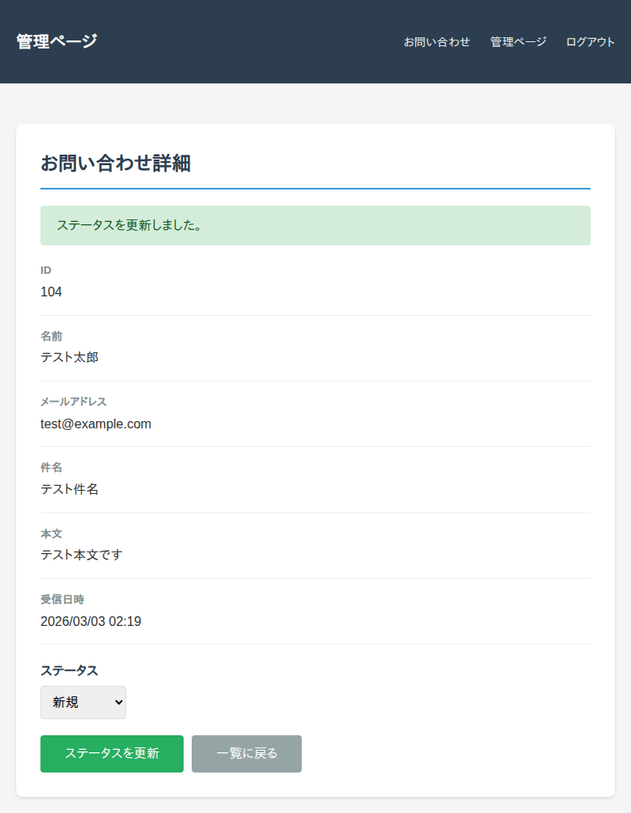

---

#### BT-15-5 一覧への反映確認

| 項目 | 内容 |
|------|------|
| 操作手順 | ステータス更新後、一覧画面で確認する |
| 期待結果 | 一覧画面でも更新後のステータスが反映されている |
| 結果 | OK / NG |
| 備考 | |

**スクリーンショット:**

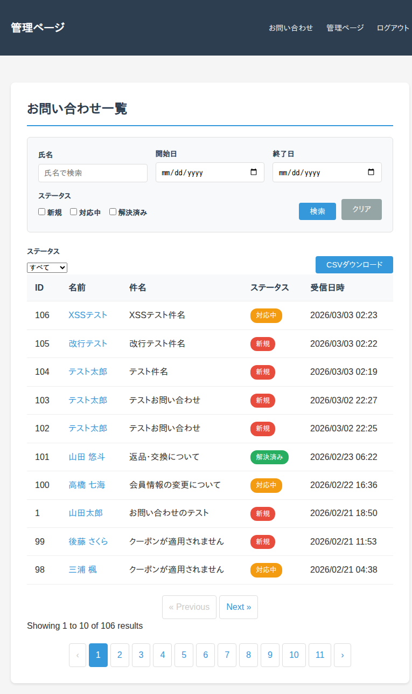

---

### BT-16 ログアウト

#### BT-16-1 ログアウト実行

| 項目 | 内容 |
|------|------|
| 操作手順 | ヘッダーのログアウトボタンを押す |
| 期待結果 | ログイン画面にリダイレクトされる |
| 結果 | OK / NG |
| 備考 | |

**スクリーンショット:**

---

#### BT-16-2 ログアウト後のセッション

| 項目 | 内容 |
|------|------|
| 操作手順 | ログアウト後に管理画面URLに直接アクセスする |
| 期待結果 | ログイン画面にリダイレクトされる |
| 結果 | OK / NG |
| 備考 | |

**スクリーンショット:**

---

## 総合所見

| 項目 | 内容 |
|------|------|
| 総合判定 | 合格 / 条件付き合格 / 不合格 |
| 特記事項 | |
| 次回対応事項 | |

---

以上
