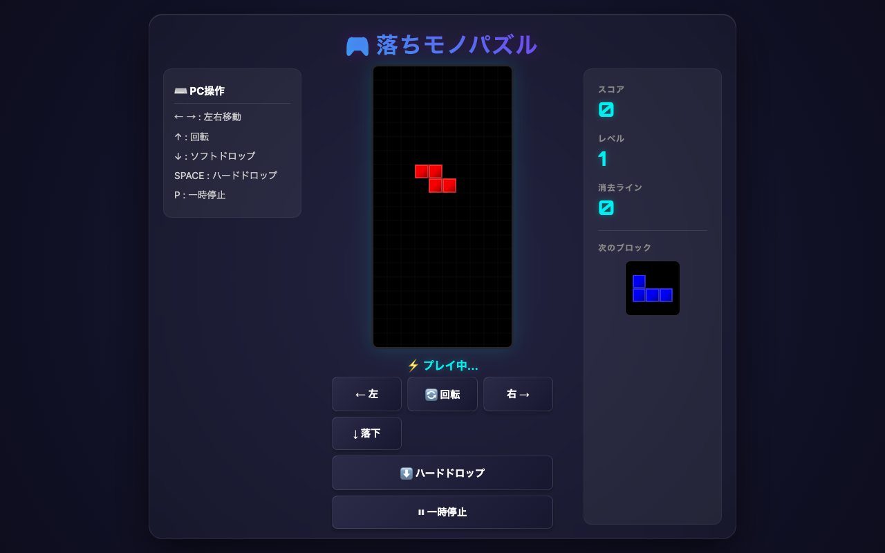

# 落ちモノパズル

ブラウザだけで遊べるシンプルな落ちモノパズルゲームです。  
`index.html` ひとつで完結しているので、追加の依存関係やビルド手順はありません。



## 目次

- [ゲーム概要](#ゲーム概要)
- [起動方法](#起動方法)
- [遊び方](#遊び方)
- [操作方法](#操作方法)
- [スコアとレベル](#スコアとレベル)
- [ゲームオーバーと再開](#ゲームオーバーと再開)
- [攻略のコツ](#攻略のコツ)
- [ファイル構成](#ファイル構成)

## ゲーム概要

このゲームは、7種類のテトロミノを操作して横一列を揃え、ラインを消していく定番の落ちモノパズルです。

- 盤面サイズは `10 × 20`
- スコア、レベル、消去ライン数を表示する
- PC操作とタッチ操作の両方に対応している
- **縦スクロール不要のレスポンシブ設計**: モバイルでもPCでも、画面アスペクト比に合わせてCanvasやUI要素が自動スケーリングし、1画面内にきれいに収まります。
- **グラスモルフィズム＆プレミアムデザイン**: すりガラス風の美しいUIパネル、ネオン調のデジタルフォント、光沢加工された立体的なテトロミノブロックなど、視覚的に洗練されたクオリティへと進化しています。
- **環境に最適化した自動配置**: PC環境ではPC操作説明を含む3カラムレイアウト、モバイル環境では情報パネルを横一列に並べた省スペースな縦レイアウトへ自動で切り替わります。

## 起動方法

このゲームは単一の HTML ファイルで動作します。起動方法は次のどちらかです。

1. `index.html` をブラウザで直接開く
1. ローカルサーバーで配信する

ローカルサーバーを使う場合は、プロジェクト直下で次のように起動します。

```bash
python3 -m http.server 8000
```

その後、ブラウザで `http://localhost:8000/` を開いてください。

## 遊び方

上から落ちてくるブロックを左右に動かし、回転させながら下へ積み上げます。  
横一列がすべて埋まると、そのラインが消去されます。

基本の流れは次のとおりです。

1. ブロックが上から自動で落下する
1. 左右移動や回転で形を整える
1. 下まで到達したブロックが固定される
1. 横一列が埋まればラインが消える
1. 消したライン数に応じてスコアが増える
1. ブロックの積み上がりが上端に達するとゲームオーバー

## 操作方法

### PC操作

- `←` `→` : 左右移動
- `↑` : 回転
- `↓` : ソフトドロップ
- `SPACE` : ハードドロップ
- `P` : 一時停止 / 再開
- `Enter` : ゲームオーバー後にリスタート

### タッチ操作

画面下部のボタンでも操作できます。

- `左` : 左へ移動
- `回転` : ブロックを回転
- `右` : 右へ移動
- `落下` : 1マス下へ移動
- `ハードドロップ` : 最下段まで一気に落とす
- `一時停止` : 一時停止 / 再開

### 補足

- `↓` を押し続けると、ブロックを連続で落とせます
- `↑` の回転は、壁や他ブロックと重なる場合は無効になります
- `SPACE` と `ハードドロップ` は最下段まで移動しますが、この実装では次の落下更新で固定されます

## スコアとレベル

ライン消去時のスコアは、同時に消した本数とレベルに応じて増えます。

- 1ライン消去: `100 × レベル`
- 2ライン消去: `300 × レベル`
- 3ライン消去: `500 × レベル`
- 4ライン消去: `800 × レベル`

レベルは `10ライン` 消すごとに上がります。  
レベルが上がるほど落下速度が速くなり、最終的には最短 `100ms` 間隔まで加速します。

## ゲームオーバーと再開

新しいブロックが出現した時点で、すでに盤面と重なっているとゲームオーバーになります。

- ゲームオーバー中は操作できません
- `Enter` を押すと最初からやり直せます

一時停止中は落下も入力も止まります。  
`P` またはタッチの `一時停止` ボタンで切り替えできます。

## 攻略のコツ

- 盤面の高さをできるだけ低く保つ
- `次のブロック` を見て、着地点を先に決める
- `I` ミノは4ライン消しの狙いに使いやすい
- 積み方に凹凸を作りすぎない
- `ハードドロップ` は素早く配置したいときに便利

## ファイル構成

- `index.html` : HTML、CSS、JavaScript をすべて含む本体

