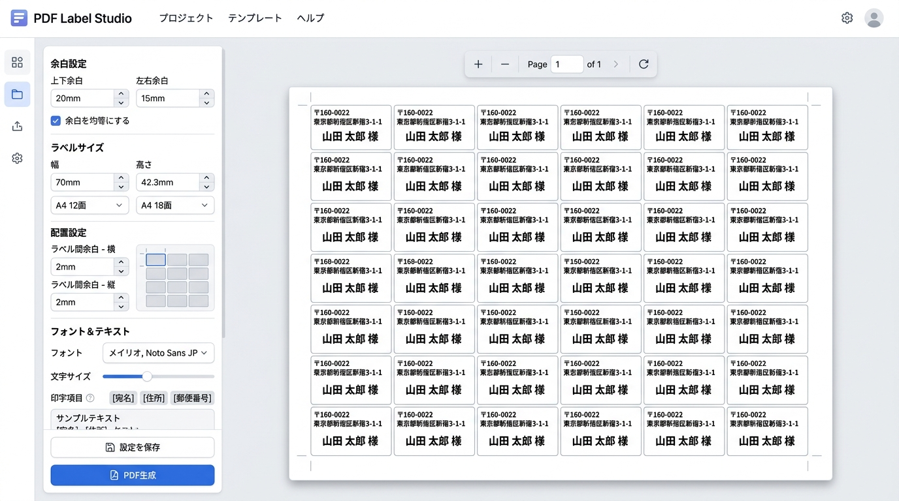

# PDF Label Studio (PDFラベルメーカー)

テキストを入力し、市販の様々なラベル用紙の寸法に合わせて自動レイアウトされたPDFを生成する、完全サーバーレス・クライアントサイド完結のWebアプリケーションです。



---

## 目次 (TOC)

- [プロジェクト概要](#プロジェクト概要)
- [主な特徴](#主な特徴)
- [技術仕様](#技術仕様)
- [使用方法](#使用方法)
- [開発者向けガイド](#開発者向けガイド)
  - [インストール](#インストール)
  - [テストの実行](#テストの実行)
  - [テスト自動化とカバレッジ](#テスト自動化とカバレッジ)
- [リポジトリ構成](#リポジトリ構成)
- [ライセンス](#ライセンス)

---

## プロジェクト概要

本アプリケーションは、ブラウザだけで動作する軽量で高速なPDFラベル生成ツールです。面倒なサーバーサイドの処理やユーザー登録は一切不要で、個人情報の漏洩リスクを完全に排除したセキュアな設計になっています。
事前定義されたラベル用紙プリセット（エーワン製など）を選択するか、ミリ単位でカスタム寸法を指定して、宛名ラベルや商品ラベルなどを誰でも簡単に作成できます。

## 主な特徴

- **完全クライアントサイド動作**: PDF生成、フォント読み込み、レイアウト計算のすべてをブラウザ上で実行します。
- **リアルタイムプレビュー**: 余白やラベルの寸法、フォントサイズなどを変更すると、右側のA4用紙シミュレータにリアルタイムで反映されます。
- **ミリ単位の精密レイアウト**:
  - 用紙の上下左右余白、ラベルの幅・高さ、列/行スペースを自在に設定可能。
  - 用紙サイズ内に収まる最大行数・列数を自動計算。
- **日本語フォント対応**: Noto Sans JP フォントを内蔵（または自動プリロード）し、PDF出力時の文字化けやレイアウト崩れを防ぎます。
- **自動折り返し・高さ制限保護**: 入力された長いテキストはラベル幅に合わせて自動で改行され、ラベルの下限を超える場合は自動的に印字が打ち切られます。
- **豊富な用紙プリセット**: [labellist.js](labellist.js) に定義された市販ラベル用紙からワンクリックでレイアウトを選択可能です。

## 技術仕様

- **コア**: HTML5 / CSS3 (CSSカスタムプロパティ、Grid、Flexbox)
- **ロジック**: Vanilla JavaScript (ES6)
- **ライブラリ**:
  - [jsPDF](https://github.com/parallax/jsPDF) (PDF生成エンジン、CDN経由で読み込み)
  - [Noto Sans JP (ttf)](https://fonts.google.com/specimen/Noto+Sans+JP) (Google Fonts CDNから動的フェッチ/キャッシュ)
- **テスト**: [Vitest](https://vitest.dev/) (v8 カバレッジプロバイダ) & [JSDOM](https://github.com/jsdom/jsdom)

## 使用方法

1. [index.html](index.html) をブラウザで開きます。
2. 左側のコントロールパネルから「プリセット」を選択するか、詳細設定パラメータを変更します。
3. 印字したいテキストエリア（宛名など）を入力します。
4. 「PDF生成」ボタンをクリックすると、別タブで印刷用のPDFが自動的に構築されて表示されます。

---

## 開発者向けガイド

### インストール

テストの実行やカバレッジ検証を行うには、Node.js 環境と依存パッケージをインストールする必要があります。

```bash
# 依存関係のインストール
npm install
```

### テストの実行

本プロジェクトは [Vitest](https://vitest.dev/) と [JSDOM](https://github.com/jsdom/jsdom) を用いて、UIロジックおよびPDF描画ロジックの動作検証を完全に自動化しています。

```bash
# テストの実行 (Vitestによる単発実行)
npm run test

# ウォッチモードでの実行
npm run test:watch

# カバレッジ測定の実行
npm run test:coverage
```

### テスト自動化とカバレッジ

本プロジェクトはテストの品質維持のために以下の仕組みを備えています。
* **カバレッジ 100% の維持**: テストカバレッジの閾値が `100%` に固定されており、`index.js` または `labellist.js` のカバー率が 100% を下回るとテストランナーが失敗します。
* **自動ビルド＆クリーンアップ**:
  - `pretest` スクリプトが実行され、`index.html` 内のインラインスクリプトを自動抽出して [index.js](index.js) を生成します。
  - テスト終了後には `posttest` スクリプトが働き、一時ファイルである `index.js` が自動でクリーンアップ（削除）されます。

---

## リポジトリ構成

```text
├── index.html           # アプリケーション本体 (HTML/CSS/JS)
├── labellist.js         # ラベル用紙の寸法プリセット定義データ
├── package.json         # テスト・ビルドスクリプト定義
├── vitest.config.js     # Vitest 設定ファイル
├── scripts/
│   └── extract-script.js# インラインJS抽出用ヘルパースクリプト
├── test/
│   └── index.test.js    # JSDOM/Mockを用いた自動テストコード
├── docs/
│   └── code-review-*.md # 品質検証のためのコードレビュー結果履歴
└── screenshots/
    └── app_screenshot.jpg# README用アプリケーション画面イメージ
```

## ライセンス

本プロジェクトはオープンソースです。商用・非商用問わず無償で利用・改造が可能です。
