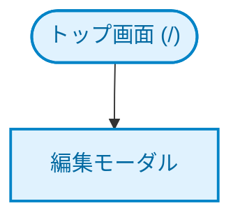

# README.md 作成・構成スタイルガイド

このスキルは、本リポジトリ（`study-claude`）におけるプロジェクト用の `README.md` の統一された書式・構成・デザインパターンを提供します。リポジトリ内の各サブプロジェクト（`example-001`, `contact-form`, `todo-app`, `todo-app2`）で採用されている高品質なドキュメントスタイルを一貫して適用・維持するためのガイドラインです。

---

## 🎨 統一された README の基本構成（セクション構造）

プロジェクトの `README.md` は原則として以下の構造で記述します。

1. **タイトルと導入概要**
2. **ライブデモ/デプロイ先リンクおよびCIバッジ**
3. **目次 (Table of Contents)**
4. **操作デモ（アニメーション）**
5. **画面遷移図 (Mermaidフローチャート)**
6. **機能詳細**
7. **環境要件・技術スタック**
8. **デプロイ方針**
9. **インストール・セットアップ**
10. **主要コマンド（コマンドリファレンス）**
11. **ディレクトリ構造**
12. **開発ガイド（原則、コーディング規約、開発フロー）**
13. **テスト詳細・品質保証**
14. **トラブルシューティング**
15. **ライセンス**

---

## 📝 各セクションの記述詳細とデザインパターン

### 1. タイトル、導入、クイックリンク・バッジ
* **タイトル**: `# プロジェクト名 (フォルダ名)` または `# プロジェクト名`。
* **導入**: アプリケーションの概要、核となる価値、技術的なハイライトを2〜3行で簡潔に説明します。
* **クイックリンク**: 🚀 マークをつけて、GitHub Pages などの公開デプロイ先への直リンクを記載します。
* **CIバッジ**: GitHub Actions のビルド・テスト結果バッジを配置します。
  ```markdown
  🚀 **デプロイ先 (GitHub Pages):** [https://<username>.github.io/study-claude/<project>/](https://<username>.github.io/study-claude/<project>/)
  
  [](https://github.com/<username>/study-claude/actions/workflows/<workflow>.yml)
  ```

### 1.5 目次 (TOC: Table of Contents)
* **重要**: ドキュメント全体の可読性および各セクションへのアクセスを容易にするため、導入（およびクイックリンク）の直後には必ず **目次 (TOC)** を含めること。
* 各主要セクション（`##` で始まるヘッダー）への相対リンク（アンカーリンク）を網羅したリストを作成します。

### 2. 操作デモ（アニメーション）
* `screenshots/demo_animation.gif` または `demo_*.gif` を埋め込みます。
* デモ動画が「どのような操作シーケンスをカバーしているか」を箇条書きで示します。
* デモ録画の生成方法（`npm run record:demo` など）がある場合は、実行コマンドと仕組みを併記します。
* `> [!TIP]` コールアウトを用いて、可視化スキル（`browser-tests`）へのリンクと紹介を行います。

### 3. 画面遷移図（Mermaid フローチャート）
* `mermaid` ブロックを使用し、シンプルかつ明確な画面遷移（SPAのモーダル表示、Laravelの複数ステップなど）を視覚化します。
* **配色ルール（classDef）**:
  * 一般向け画面（パブリック）: 青系（例: `#e0f2fe`, `#0284c7`）
  * 管理画面（管理者専用）: 黄・オレンジ系（例: `#fef3c7`, `#d97706`）
  * 開始・終了ノード: 緑系（例: `#f0fdf4`, `#16a34a`）
  * SPAモーダル等: 紫系（例: `#1e293b`, `#a855f7`）
  
  ```mermaid
  flowchart TD
      classDef public fill:#e0f2fe,stroke:#0284c7,stroke-width:2px,color:#0369a1;
      classDef admin fill:#fef3c7,stroke:#d97706,stroke-width:2px,color:#92400e;
      classDef startEnd fill:#f0fdf4,stroke:#16a34a,stroke-width:2px,color:#15803d;
  
      Node1(["開始画面 (/)"]) --> Node2["入力画面 (/input)"]
      class Node1 startEnd;
      class Node2 public;
  ```

### 4. 機能詳細
* アプリの主要機能（入力画面、確認画面、一覧、ソート、検索、CSV出力など）を画像付きで詳細に紹介します。
* バリデーション、XSS対策（DOMPurifyサニタイズ）、多重送信防止対策など、UXやセキュリティの裏付けがある処理を論理的にアピールします。

### 5. 環境要件・技術スタック
* 動作要件（Node.js, PHP, SQLiteなどのバージョン）を記載します。
* 技術スタックを表形式で整理します。
  ```markdown
  | 技術 | バージョン | 用途 |
  |------|-----------|------|
  | **Vite** | 6.x | 開発サーバー・アセットビルド |
  | **Quill** | 2.0+ (CDN) | リッチテキストエディタ |
  ```

### 6. デプロイ方針
* アプリケーションがどのように稼働・デプロイされるか（GitHub Pagesによる静的配信、Laravel＋SQLiteによる単一ホスト構成など）の前提条件を明記します。意思決定の背景（ADR等）があればリンクします。

### 7. インストール・セットアップ / 主要コマンド
* クローンから依存関係のインストール、テスト実行までのステップをコードブロックで記述します。
* 初心者でもすぐに動かせるよう、自動セットアップ（`composer setup` 等）や推奨起動手順を提供します。
* コマンドリファレンスとして、`dev`, `build`, `test`, `lint`, `format` などのコマンドをまとめます。

### 8. ディレクトリ構造
* プロジェクトの全体像を理解しやすくするため、ASCIIツリー形式で主要なファイルを説明付きで一覧化します。
* ファイルへのリンクは、GitHub markdown スタイルで絶対または相対の `file://` スキームを用いたリンクにします。
  ```text
  todo-app2/
  ├── src/
  │   ├── ui/
  │   │   └── [main.js](file:///Users/katoy/github/study-claude/todo-app2/src/main.js)   # エントリポイント
  ```

### 9. 開発ガイド・規約
* プロジェクト特有の設計原則（例: 「単一ファイルの整合性を守る」「TDDの徹底」「日本語コメントの統一」など）を定義します。

### 10. テスト詳細・品質保証 / トラブルシューティング
* 品質保証状況（カバレッジ100%達成や、350件以上のテストパスなど）を表形式で提示します。
* トラブルシューティングには、ローカルファイル実行時におけるセキュリティ制約（Secure Context等）の回避方法やポート衝突時の具体的な解決手順をQ&A形式で明記します。

### 11. ライセンス
* **重要**: 本リポジトリ内のプロジェクトおよびコード資産は、オープンかつ標準的な開発慣行に従い、原則として **MIT ライセンス (MIT License)** を適用すること。
* README.md の末尾には必ず `## ライセンス` のヘッダーを設け、ライセンス名を明記します。

---

## 📌 コールアウトの活用ルール

ドキュメント内で強調したい内容や補足事項がある場合は、GitHub Flavored Markdown のコールアウト構文を積極的に活用して視認性を高めます。

* `> [!TIP]`: 再利用可能なノウハウや推奨事項（例：デモ自動撮影やスキルの再利用）
* `> [!NOTE]`: 仕様の補足や解説
* `> [!IMPORTANT]`: テスト実行時の順次実行指定（workers制限）などの必須条件
* `> [!WARNING]`: セキュリティ制限（HTTPS環境やローカルサーバー経由でないと動作しないAPI等）

---

## 📂 テンプレート (`TEMPLATE.md`)

新しくサブプロジェクトを追加する、または既存のREADMEを再構成する際にコピーして使用できる基本スケルトンです。

```markdown
# プロジェクト名 (ディレクトリ名)

アプリケーションの簡潔な説明（2〜3文）。

🚀 **デプロイ先 (GitHub Pages):** [https://katoy.github.io/study-claude/<dirname>/](https://katoy.github.io/study-claude/<dirname>/)

[](https://github.com/katoy/study-claude/actions/workflows/<filename>.yml)

---

## 目次

- [操作デモ（アニメーション）](#操作デモアニメーション)
- [画面遷移](#画面遷移)
- [機能](#機能)
- [環境要件・技術スタック](#環境要件・技術スタック)
- [デプロイ方針](#デプロイ方針)
- [インストール・セットアップ](#インストール・セットアップ)
- [主要コマンド](#主要コマンド)
- [ディレクトリ構造](#ディレクトリ構造)
- [開発ガイド](#開発ガイド)
- [テスト詳細・品質保証](#テスト詳細・品質保証)
- [トラブルシューティング](#トラブルシューティング)
- [ライセンス](#ライセンス)

---

## 操作デモ（アニメーション）


**主な操作フロー:**
1. 操作手順のステップ1
2. 操作手順のステップ2

> [!TIP]
> 操作デモの自動撮影と高品質GIFへの変換技術は、[browser-tests スキル](file:///Users/katoy/github/study-claude/skills/browser-tests/SKILL.md)にテンプレートが定義されています。

---

## 画面遷移



---

## 機能

### 主要機能A
* **特徴**: 機能の説明
* **考慮点**: 堅牢性やサニタイズなどの処理内容

---

## 環境要件・技術スタック

### 必要要件
* Node.js v20 以上
* SQLite など

### 技術スタック
| 技術 | バージョン | 用途 |
|------|-----------|------|
| **Core** | HTML5 / CSS3 / Vanilla JS | アプリケーション本体 |

---

## インストール・セットアップ

```bash
npm install
```

---

## 主要コマンド

```bash
npm run dev      # 開発サーバー起動
npm run test     # テスト実行
```

---

## ディレクトリ構造

```text
dirname/
├── src/                 # ソースコード
├── tests/               # テストコード
└── [README.md](file:///Users/katoy/github/study-claude/dirname/README.md)             # 本ファイル
```

---

## 開発ガイド

### コーディング規約
* 変数名はキャメルケース、DOMのIDはケバブケースとします。
* コメントは日本語で統一します。

---

## テスト詳細・品質保証

### カバレッジ・統計
| テストスイート | テスト数 | 目標カバレッジ | 実績ステータス |
|---|---|---|---|
| 全機能テスト | X 件 | **100%** | **PASS / 100%** |

---

## トラブルシューティング

#### 問題: ローカルで index.html を直接開くとエラーになる
* **原因**: Secure Context の制約
* **対策**: ローカルサーバー経由（http://localhost）で起動してください。

---

## ライセンス

MIT
```
