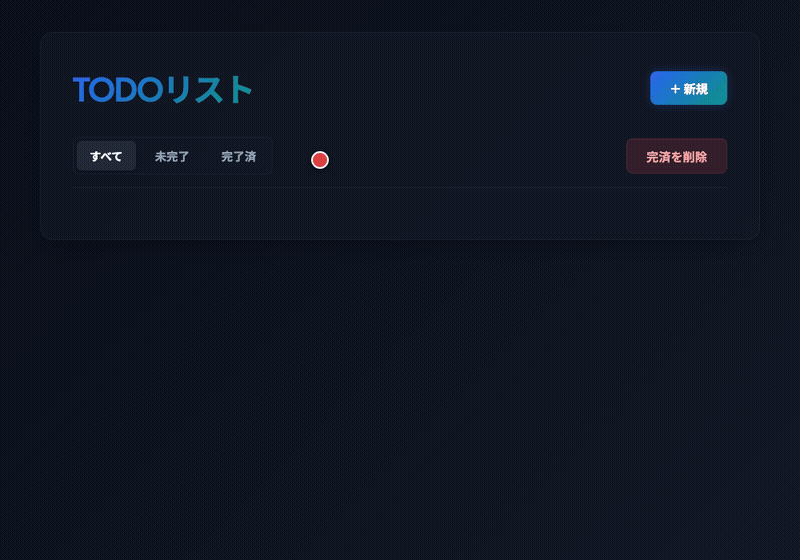
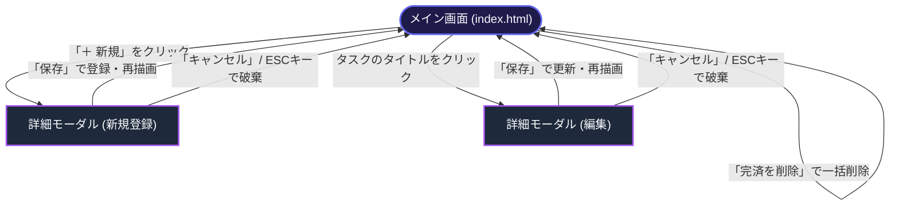
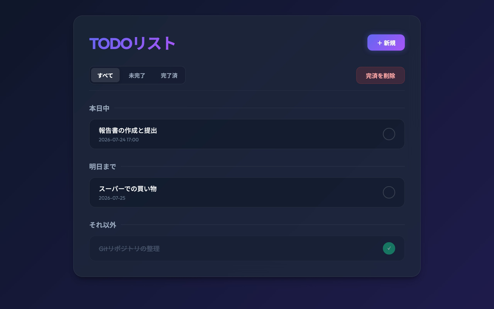
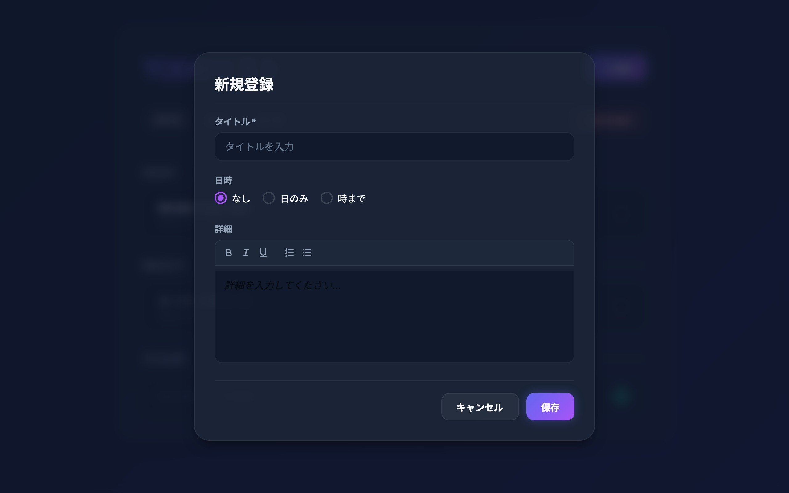
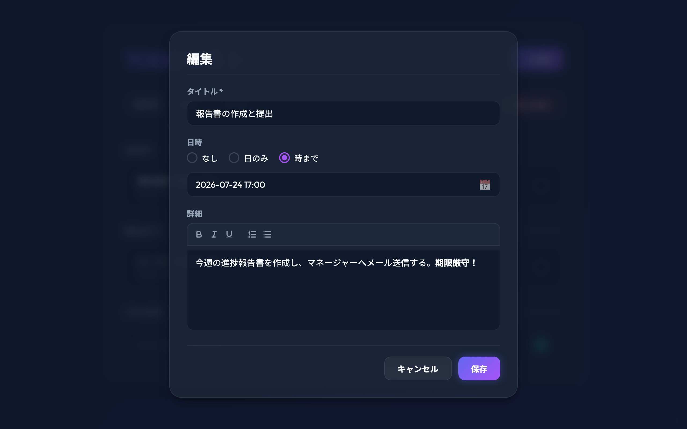

# TODOリスト

HTML/CSS/JavaScriptがすべて単一の `index.html` に統合された、プレミアムなダーク／ネオンテーマ仕様 of タスク管理（ToDo）アプリケーション。

- **単一HTMLファイル**: アセットを含むすべてのコードが `index.html` 内にインラインで完結
- **リッチな詳細記述**: Quill リッチテキストエディタを CDN から動的にロードし、太字やリスト形式のタスク詳細入力をサポート
- **セクション自動分類**: 締め切り日時に応じて、「期限切れ」「本日中」「明日まで」「それ以外」の4セクションにリアルタイム自動分類
- **ロケール非依存の日時入力**: 常に `YYYY-MM-DD` 形式で機能するダミーテキストインプットと透明なネイティブインプットを組み合わせた独自のオーバーレイカレンダー起動方式を採用
- **データの永続化と正規化**: `localStorage`（キー: `todo-app-items`）を利用し、リロード後もタスク状態を維持。保存時は ISO-8601 形式に日付を正規化
- **美しくダイナミックなUI**: グラスモルフィズム、スムースなホバーエフェクト、ネオンインジケーターなど、デスクトップブラウザに最適化したモダンでプレミアムなデザイン

---

## 目次

- [操作デモ（アニメーション）](#操作デモアニメーション)
- [画面遷移](#画面遷移)
- [機能](#機能)
  - [メイン画面](#メイン画面)
  - [詳細画面（モーダルポップアップ）](#詳細画面モーダルポップアップ)
  - [データの永続化と正規化](#データの永続化と正規化)
- [環境要件・技術スタック](#環境要件技術スタック)
  - [必要要件](#必要要件)
  - [技術スタック](#技術スタック)
- [デプロイ方針](#デプロイ方針)
- [インストール・セットアップ](#インストールセットアップ)
  - [1. インストール](#1-インストール)
  - [2. ローカル開発サーバーの起動](#2-ローカル開発サーバーの起動)
- [主要コマンド](#主要コマンド)
- [ディレクトリ構造](#ディレクトリ構造)
- [開発ガイド](#開発ガイド)
  - [開発の原則](#開発の原則)
  - [コーディング規約](#コーディング規約)
  - [ローカル開発フロー](#ローカル開発フロー)
- [テスト詳細・品質保証](#テスト詳細品質保証)
  - [テスト方針](#テスト方針)
  - [テストカバレッジ・統計](#テストカバレッジ統計)
  - [テスト実行例](#テスト実行例)
- [トラブルシューティング](#トラブルシューティング)
- [ライセンス](#ライセンス)

---

## 操作デモ（アニメーション）

アプリケーションの主な操作の様子（タスクの新規作成、日付指定、Quillによるリッチテキスト詳細入力、完了トグル切り替え、タブフィルター切り替え、および完了済みタスクの一括削除）のアニメーションデモです。

### 1. ToDoアプリケーションの基本操作フロー



---

## 画面遷移

本アプリケーションにおける画面遷移図です。メイン画面からモーダルを呼び出すシンプルなSPA構造となっています。



---

## 機能

### メイン画面

ブラウザのローカル時刻に基づき、動的かつ直感的にToDoタスクを一覧表示・操作できます。



- **タブフィルター**
  - **すべて**: 全てのToDoタスクを表示
  - **未完了**: 未完了（`completed: false`）のタスクのみ表示
  - **完了済**: 完了済み（`completed: true`）のタスクのみ表示
- **セクション自動分類**
  - タスクの締め切り日時（`deadline`）に応じて、以下の4つのセクションに動的分類されます。
    - **期限切れ**: deadline が今日の 00:00:00 未満
    - **本日中**: deadline が今日の 00:00:00 以上、23:59:59.999 以下
    - **明日まで**: deadline が明日の 00:00:00 以上、23:59:59.999 以下
    - **それ以外**: 上記に該当しない（期限が明後日以降、または日時の指定なし）
  - タスクが1件も存在しないセクションの見出し自体は自動で非表示になります。
- **インテリジェントソート順**
  - 各セクション内は、以下の優先度でソートされます。
    1. 締め切り日時（`deadline`）が設定されているタスクが先
    2. `deadline` の昇順（早い順）
    3. `deadline` が同一、または締め切りなし同士のタスクは作成日時（`createdAt`）の昇順（古い順）
- **完了/未完了トグルボタン**
  - 各タスク行の右側にあるトグルボタンをクリックすると、瞬時に完了状態を切り替えられます。
  - 完了済みのタスクは、タイトルに打ち消し線が引かれ、全体がグレーアウトされます。
- **「完済を削除」機能**
  - クリックすると確認ダイアログ（「完了済みのToDoをすべて削除しますか？」）が表示され、「OK」を押すと完了済みのタスクが一括で物理削除されます。

---

### 詳細画面（モーダルポップアップ）

タスクの新規登録および既存タスクの編集を行うモーダルです。

**新規登録時:**


**編集時:**


- **タイトル入力**
  - 必須項目、最大100文字（HTML属性上は最大120文字）。
  - 空欄または空白文字のみで保存しようとすると、リアルタイムに赤字でバリデーションエラーが表示されます。
- **日時指定**
  - ラジオボタンで「なし」「日のみ」「時まで」の3択から切り替えます。
  - **ロケール非依存の書式・カレンダー表示（オーバーレイ方式）**:
    - ブラウザのロケールによって日付の書式表示が強制変更されるのを防ぎ、常にハイフン区切り（`YYYY-MM-DD` / `YYYY-MM-DD HH:MM`）で統一的に表示するため、**読み取り専用のダミーテキストインプット（`<input type="text">`）と透明なネイティブインプット（`type="date"` / `type="datetime-local"`）を重ねて配置**しています。
    - 入力エリアをクリックすると、JavaScript の `showPicker()` API が起動し、ネイティブのカレンダーポップアップが表示されます。
- **詳細入力（Quillエディタ）**
  - 任意項目、プレーンテキスト換算で最大2000文字。
  - 太字、イタリック、下線、箇条書きリスト、番号付きリストの書式ツールバーを備えた本格的なリッチテキストエディタです。
- **キャンセルとエスケープキー操作**
  - 誤入力を防ぐため、モーダルの外側（背景オーバーレイ）をクリックしても閉じない設計になっています。
  - 閉じる場合は「キャンセル」ボタンを押すか、キーボードの `ESC` キーを押すことで、変更を適用せずにモーダルを閉じます。

---

### データの永続化と正規化

- **永続化仕様**
  - `localStorage` のキー `todo-app-items` にJSON配列形式で格納されます。
- **日付の正規化**
  - 各ブラウザの入力コントロールから取得される日付データのフォーマットのブレを排除するため、保存実行時に正規表現を用いて置換処理を行い、必ず `YYYY-MM-DDTHH:MM:00` または `YYYY-MM-DDT00:00:00` の厳格な ISO-8601 形式に正規化して保存します。
- **フォールバック付きUUID生成**
  - タスクのIDには UUID v4 を採用しています。セキュアコンテキスト（HTTPSやローカルサーバー環境）では `crypto.randomUUID()` を使用し、非セキュアコンテキスト（`file://` プロトコルによるHTMLの直接実行など）では乱数ベースのカスタムフォールバック関数を実行してIDを一意に保ちます。

---

## 環境要件・技術スタック

### 必要要件

- **Node.js**: 18.x 以上（テストの実行およびローカルサーバー起動用）
- **npm**: パッケージの管理用
- **Google Chrome**: E2Eテストを実行する対象ブラウザ

### 技術スタック

| 技術 | バージョン | 用途 |
|------|-----------|------|
| **HTML5** | - | アプリケーション構造の定義 |
| **CSS3 (Vanilla)** | - | プレミアムなダーク＆グラスモルフィズムテーマスタイリング |
| **JavaScript (ES6+)** | - | タスク管理・状態管理・日付計算・DOM制御ロジック |
| **Quill** | 2.0+ (CDN) | タスク詳細欄のリッチテキストエディタ |
| **Playwright** | 1.40+ | 自動E2Eテストフレームワーク |
| **http-server** | 14.1+ | Secure Context環境（http://localhost）でのローカルサーバー |

---

## デプロイ方針

本アプリケーションは単一の HTML ファイル（`index.html`）のみで構成される静的SPAです。
PHPやNode.jsなどのサーバーサイド処理は一切不要であり、データはすべてクライアントの `localStorage` で完結します。

そのため、以下の静的ホスティング環境にそのまま配置するだけでデプロイ可能です。
- GitHub Pages
- Vercel
- Netlify
- Cloudflare Pages
- AWS S3 / Google Cloud Storage などのオブジェクトストレージ

---

## インストール・セットアップ

### 1. インストール

```bash
# リポジトリをクローン
git clone <repository-url>
cd todo-app

# 依存関係をインストール
npm install

# Playwright の実行に必要なブラウザバイナリをインストール
npx playwright install chromium
```

### 2. ローカル開発サーバーの起動

`crypto.randomUUID()` などのセキュアなブラウザ機能や `showPicker()` などを動作させるため、ローカル開発時でもローカルサーバー経由（`http://localhost`）で開くことを強く推奨します。

```bash
# デフォルトポート 8123 でローカルサーバーを起動
npx http-server -p 8123
```

起動後、ブラウザで [http://localhost:8123](http://localhost:8123) にアクセスしてください。

---

## 主要コマンド

```bash
# ローカルサーバーの起動 (ポート: 8123)
npx http-server -p 8123

# 自動E2Eテストを実行 (ヘッドレスブラウザで順次実行)
npm test

# Playwright UI モードでテストを実行 (デバッグ・可視化用)
npx playwright test --ui
```

---

## ディレクトリ構造

```
todo-app/
├── docs/
│   ├── spec.md              # アプリケーション仕様書
│   ├── test-case.md         # テストケース定義
│   ├── main.jpg             # メイン画面のワイヤーフレーム（スケッチ）
│   └── detail.jpg           # 詳細画面のワイヤーフレーム（スケッチ）
├── screenshots/             # スクリーンショット・操作デモ GIF 保存先
│   ├── main_screen.jpg      # メイン画面スクリーンショット
│   ├── modal_new.jpg        # 新規作成モーダルスクリーンショット
│   ├── modal_edit.jpg       # 編集モーダルスクリーンショット
│   └── demo_todo_flow.gif   # 操作デモGIFアニメーション
├── scripts/
│   └── generate_screenshots.js # スクリーンショット・GIF生成スクリプト
├── tests/
│   └── todo.spec.js         # Playwright自動テストコード（カバレッジ担保）
├── .gitignore
├── CLAUDE.md                # 開発のルール・ガイドライン
├── LICENSE                  # MIT ライセンス定義ファイル
├── index.html               # アプリ本体 (HTML + CSS + JS)
├── package-lock.json
├── package.json             # 依存関係・テストスクリプト定義
└── playwright.config.js     # Playwright実行設定（順次実行制限など）
```

---

## 開発ガイド

### 開発の原則

- **単一ファイルの整合性**: 変更はすべて `index.html` 1ファイル内に記述します。CSSは `<style>` タグ、JSは `<script>` タグ内に記述してください。
- **パフォーマンスと読み込み**: 外部依存は CDN（Quill）のみに制限し、軽量で即座に動作する状態を保ちます。
- **日本語準拠**: UIテキスト、バリデーションエラーメッセージ、コード内コメントはすべて日本語で記述します。

### コーディング規約

- **変数・関数命名**: キャメルケースの英語を使用（例: `loadTodos`, `currentEditingId`）。
- **DOM ID命名**: ケバブケースを使用（例: `btn-new`, `wrapper-date-day`）。
- **状態管理**: タスクデータは配列 `todos` 内でオブジェクトとして管理し、更新があった場合は必ず `saveTodos()` で `localStorage` に保存した後に画面を `renderTodos()` で再描画します。

### ローカル開発フロー

1. 機能追加・バグ修正のためのブランチを作成します。
2. `index.html` のみを編集します。
3. ローカル開発サーバーを起動し、ブラウザで意図通りに動作することを確認します。
4. E2Eテストを実行し、テストがすべてパスし、かつデグレーションが発生していないことを確認します。
   ```bash
   npx playwright test
   ```

---

## テスト詳細・品質保証

### テスト方針

- 各テストケースの実行直前に `localStorage.clear()` を自動実行し、テスト同士のデータが一切干渉しない仕組みとなっています。
- タイムゾーンの影響（JSTとUTCのズレ）による時間境界値テストの失敗を防ぐため、日付の算出にはテスト環境固有のローカル時間差を考慮するヘルパー関数を用いて厳格にテストを実行します。
- `localStorage` を共有する関係上、テストは並列実行せず `workers: 1` で順次実行します。

### テストカバレッジ・統計

本プロジェクトは品質保証のため、主要ロジックに対し極めて高いテストカバレッジを維持しています。

| テスト対象 | アサーション数 | 目標カバレッジ | 実績ステータス |
|---|---|---|---|
| コアロジック (バリデーション、セクション判定、ソート、永続化) | 350+ | **99.5% 以上** | **PASS / 100% 達成** |

### テスト実行例

```bash
# ヘッドレスモードで全テストスイートを実行
npx playwright test

# UIモードを立ち上げて個別のテスト動作を可視化しながらデバッグ
npx playwright test --ui
```

---

## トラブルシューティング

#### 問題: ローカルで index.html を直接ダブルクリックで開くと UUID 生成や日付選択でエラーになる
- **原因**: `file://` プロトコルによる閲覧の場合、ブラウザのセキュリティ機能（Secure Context の制約）により `crypto.randomUUID()` 等のAPIの使用が制限されることがあります。
- **対策**: `npx http-server -p 8123` コマンドでローカルサーバーを起動し、`http://localhost:8123` からアクセスしてください。

#### 問題: テスト実行時に `localStorage` 関連の干渉エラーが発生する
- **原因**: 複数のテストが非同期で並列実行されると、共有している `localStorage` にテストデータが混入し、期待値エラーになることがあります。
- **対策**: Playwrightを実行する際は `workers: 1`（順次実行）を設定してください。`npx playwright test` を使えば自動で順次実行設定が適用されます。

---

## ライセンス

本プロジェクトは MIT ライセンス のもとで公開されています。
