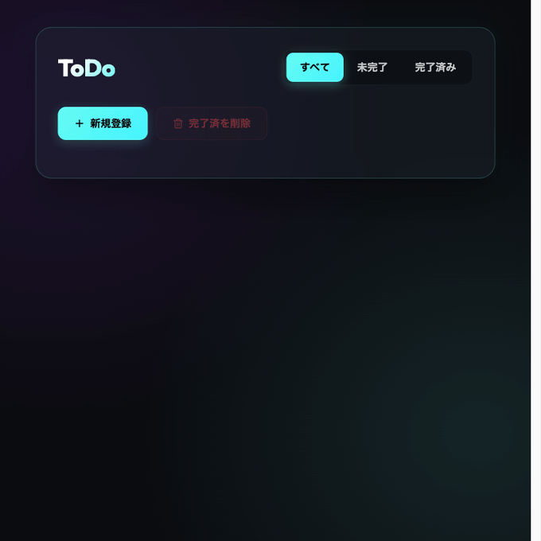
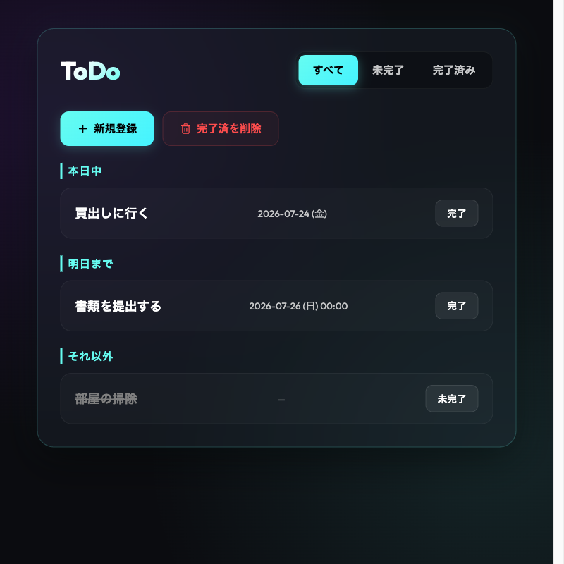
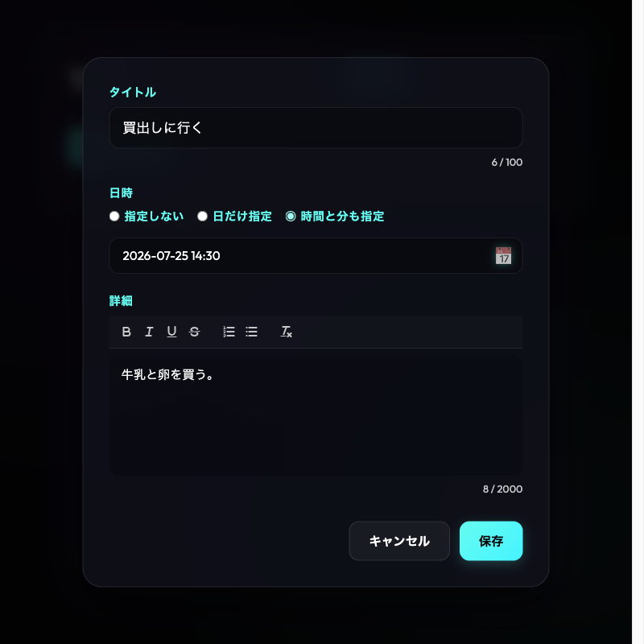

# Premium ToDo App

洗練されたダークテーマデザインとリッチテキストエディタ（Quill）を融合させ、TDD（テスト駆動開発）によって堅牢に実装されたモダンなシングルファイル型 ToDo アプリケーションです。

🚀 **デプロイ先 (GitHub Pages):** [https://katoy.github.io/todo-app2/](https://katoy.github.io/todo-app2/)

[](https://github.com/katoy/todo-app2/actions/workflows/ci-cd.yml)

---

## 🎨 主要画面とデモ動作

### 🎬 デモ動作 (GIF アニメーション)


### 🖥️ メイン画面 (主要画面)


### 📝 詳細・編集画面 (リッチテキストエディタ)


---

## ✨ アプリケーションの特徴

1. **プレミアムなダークテーマ UI**
   - 洗練されたカラーパレット（HSL）とグラデーション背景。
   - ガラスモーフィズムを用いた、美しく近未来的なデザインと滑らかな微細アニメーション。
2. **Quill v2 リッチテキスト詳細エディタ**
   - 太字・斜体・下線・取り消し線・箇条書きなどの書式サポート。
   - プレーンテキスト換算でのリアルタイムの文字数カウント（最大 2,000 文字）。
3. **直感的なカレンダー UI と一貫した日時表記・タイムゾーン制御**
   - 「指定しない」「日のみ指定」「時間と分も指定」の 3 モードに対応。
   - 前面にプレースホルダーを固定したカスタムテキストフィールド、背面に透明なブラウザ標準日付・時間ピッカーを重ね合わせた「透過レイヤー構造」を搭載。
   - すべての環境（Safari等のシステム言語設定に左右されやすいブラウザを含む）で、一貫して `年-月-日`（`YYYY-MM-DD` / `YYYY-MM-DD HH:mm`）のハイフン区切り書式で美しくプレースホルダーや入力値が表示・同期されます。
   - 右側のカレンダーアイコンまたは入力欄のクリックで、直感的なカレンダー UI ポップアップが自動で瞬時に開きます。
   - すべての締切日時を UTC 基準に補正して内部保持。
   - 日本時間（JST）に基づく「本日中」「明日まで」「それ以外」へのインテリジェントな自動セクション分類。
4. **防御的パースと強固なサニタイズ**
   - localStorage に保存されるデータのパース処理を保護し、無効なデータでのクラッシュを回避。
   - DOMPurify による厳格なサニタイズ処理を適用し、XSS（クロスサイトスクリプティング）などの脆弱性を排除。
5. **ポータブルな単一 HTML 出力**
   - Vite ビルド時に CSS および JS を完全にインライン化した、単一の HTML ファイル (`dist/index.html`) を出力。サーバーなしでのオフライン・スタンドアロン実行が可能です。

---

## 🛠️ 技術スタック

- **Core**: Vanilla JavaScript (ES Modules)
- **Styling**: Modern Vanilla CSS
- **Sanitizer**: DOMPurify
- **Rich Editor**: Quill v2 (Snow theme / Custom Dark customized)
- **Build Tool**: Vite + `vite-plugin-singlefile`
- **Testing**: Vitest + jsdom + `@testing-library/dom`
- **Linter / Formatter**: ESLint v9 (Flat Config) + Prettier

---

## 🚀 コマンドリファレンス

### パッケージのインストール
```bash
npm install
```

### ローカル開発サーバー起動
```bash
npm run dev
```

### プロダクションビルド（単一HTML出力）
`dist/index.html` に CSS/JS が内包されたスタンドアロン HTML が生成されます。
```bash
npm run build
```

### テスト実行 (Vitest)
```bash
npm run test
```

### テストカバレッジの測定
Statements, Branches, Functions, Lines の **すべてで 100% カバレッジ** を検証・保証しています。
```bash
npm run test:coverage
```

### 静的解析とコード整形
```bash
npm run lint      # Linterを実行
npm run lint:fix  # Linterによる自動修正
npm run format    # Prettierによるフォーマットチェック
npm run format:fix# Prettierによる自動整形
```

---

## 📂 ディレクトリ構成

```text
todo-app2/
├── dist/                          # ビルド成果物 (単一HTML)
├── docs/                          # 仕様書、テスト仕様書、成果レポート
├── screenshots/                   # アプリケーション画像、デモGIF
├── src/                           # ソースコード
│   ├── date/                      # 日付処理・変換
│   ├── editor/                    # Quillアダプター
│   ├── logic/                     # バリデーション、セクション分類、ソート
│   ├── models/                    # データ構造定義
│   ├── sanitize/                  # サニタイズ
│   ├── storage/                   # localStorage操作
│   ├── styles/                    # アプリのCSS
│   ├── ui/                        # UIビュー (メイン/詳細)
│   ├── constants.js               # アプリの定数
│   ├── index.html                 # 開発用テンプレート
│   └── main.js                    # エントリポイント
└── tests/                         # 単体および統合テストコード
```
