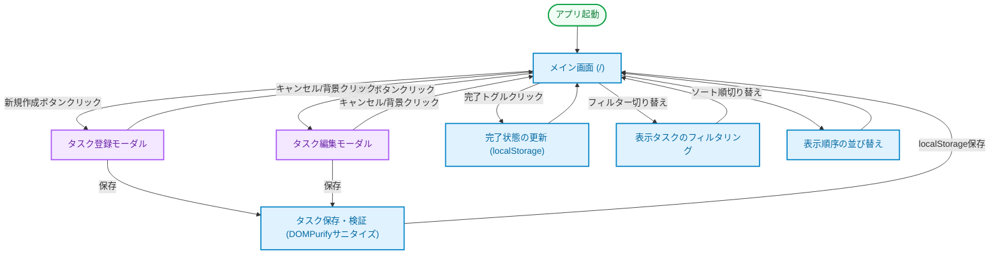

# Premium ToDo App

洗練されたダークテーマデザインとリッチテキストエディタ（Quill）を融合させ、TDD（テスト駆動開発）によって堅牢に実装されたモダンなシングルファイル型 ToDo アプリケーションです。

🚀 **デプロイ先 (GitHub Pages):** [https://katoy.github.io/study-claude/todo-app2/](https://katoy.github.io/study-claude/todo-app2/)

[](https://github.com/katoy/study-claude/actions/workflows/all-projects-ci.yml)

---

## 目次

- [操作デモ（アニメーション）](#操作デモアニメーション)
- [画面遷移](#画面遷移)
- [機能詳細](#機能詳細)
- [環境要件・技術スタック](#環境要件技術スタック)
- [デプロイ方針](#デプロイ方針)
- [インストール・セットアップ](#インストールセットアップ)
- [主要コマンド](#主要コマンド)
- [ディレクトリ構造](#ディレクトリ構造)
- [開発ガイド](#開発ガイド)
- [テスト詳細・品質保証](#テスト詳細品質保証)
- [トラブルシューティング](#トラブルシューティング)
- [ライセンス](#ライセンス)

---

## 操作デモ（アニメーション）


**主な操作フロー:**
1. **初期表示** - アプリの起動状態
2. **新規ボタン クリック** - タスク登録モーダルを開く
3. **タイトル入力** - 「技術仕様書のレビュー」を入力
4. **日時設定** - 「日のみ指定」を選択（カレンダー日付を選択）
5. **詳細入力** - Quill リッチテキストエディタに詳細説明を入力
6. **タスク保存** - 保存ボタンでタスクを登録
7. **完了操作** - タスクを完了状態に変更
8. **フィルター** - 「完了済み」「未完了」フィルタの切り替え確認

> [!TIP]
> 操作デモの自動撮影と高品質GIFへの変換技術は、[browser-tests スキル](file:///Users/katoy/github/study-claude/todo-app2/docs/skills/browser-tests/SKILL.md)にテンプレートが定義されています。
> `npm run record:demo` コマンドで、Playwrightによる自動操作と `ffmpeg` による高画質なGIFアニメーション生成が自動実行されます。

### 🖥️ メイン画面 (主要画面)


### 📝 詳細・編集画面 (リッチテキストエディタ)


---

## 画面遷移


```mermaid
flowchart TD
    classDef public fill:#e0f2fe,stroke:#0284c7,stroke-width:2px,color:#0369a1;
    classDef admin fill:#fef3c7,stroke:#d97706,stroke-width:2px,color:#92400e;
    classDef startEnd fill:#f0fdf4,stroke:#16a34a,stroke-width:2px,color:#15803d;
    classDef modal fill:#f3e8ff,stroke:#a855f7,stroke-width:2px,color:#6b21a8;

    Start(["アプリ起動"]) --> MainView["メイン画面 (/)"]
    class Start startEnd;
    class MainView public;

    MainView -->|新規作成ボタンクリック| CreateModal["タスク登録モーダル"]
    MainView -->|タスク編集ボタンクリック| EditModal["タスク編集モーダル"]
    MainView -->|完了トグルクリック| ToggleComplete["完了状態の更新 (localStorage)"]
    MainView -->|フィルター切り替え| FilterChange["表示タスクのフィルタリング"]
    MainView -->|ソート順切り替え| SortChange["表示順序の並び替え"]

    CreateModal -->|保存| SaveTask["タスク保存・検証 (DOMPurifyサニタイズ)"]
    CreateModal -->|キャンセル/背景クリック| MainView
    EditModal -->|保存| SaveTask
    EditModal -->|キャンセル/背景クリック| MainView
    
    SaveTask -->|localStorage保存| MainView
    ToggleComplete --> MainView
    FilterChange --> MainView
    SortChange --> MainView

    class CreateModal modal;
    class EditModal modal;
    class ToggleComplete public;
    class FilterChange public;
    class SortChange public;
    class SaveTask public;
```

---

## 機能詳細

### 1. プレミアムなダークテーマ UI
* **ビジュアル**: 洗練されたカラーパレット（HSL）とグラデーション背景。
* **UX**: ガラスモーフィズムを用いた近未来的なデザインと、滑らかな微細アニメーションによる直感的な操作感。

### 2. Quill v2 リッチテキスト詳細エディタ
* **表現力**: 太字・斜体・下線・取り消し線・箇条書きなどの高度な書式をサポート。
* **制限**: プレーンテキスト換算でのリアルタイムの文字数カウント機能を搭載（最大 2,000 文字）。

### 3. 直感的なカレンダー UI と一貫した日時表記
* **柔軟性**: 「指定しない」「日のみ指定」「時間と分も指定」の 3 モードに対応。
* **実装**: 前面にプレースホルダーを固定したカスタムテキストフィールド、背面に透明なブラウザ標準日付・時間ピッカーを重ね合わせた「透過レイヤー構造」を搭載。
* **互換性**: Safari等のシステム言語設定に左右されやすいブラウザを含むすべての環境で、一貫して `年-月-日`（`YYYY-MM-DD` / `YYYY-MM-DD HH:mm`）のハイフン区切り書式で美しくプレースホルダーや入力値が表示・同期されます。
* **セクション自動分類**: すべての締切日時を UTC 基準に補正して内部保持し、日本時間（JST）に基づく「本日中」「明日まで」「それ以外」へのインテリジェントな自動セクション分類を実行。

### 4. 防御的パースと強固なサニタイズ（セキュリティ対策）
* **データ復元保護**: `localStorage` からのデータ復元時に型チェックおよびUUIDの厳格な検証を行い、不正なデータが保存されていてもアプリケーションのクラッシュやデータ汚染を防ぎます。
* **サニタイズ (DOMPurify)**: リッチテキストエディタ（Quill）から取得するHTMLやUIの描画時に、悪意あるスクリプト（XSS）の注入を防ぐため、保存時と表示時の両方で DOMPurify による厳格なサニタイズ処理を二重に適用。
* **サニタイズ漏れの防止 (`eslint-plugin-no-unsanitized`)**: サニタイズ処理を経由せずに `.innerHTML` などのプロパティへの代入が行われた場合、自動で検知してコミットやビルドをブロックする ESLint ルールを強制。

### 5. ポータブルな単一 HTML 出力
* **構成**: Vite ビルド時に CSS および JS を完全にインライン化した、単一の HTML ファイル (`dist/index.html`) を出力。サーバーなしでのオフライン・スタンドアロン実行が可能です。

---

## 環境要件・技術スタック

### 必要要件
* **Node.js** v20 以上
* **Webブラウザ** (Chrome, Safari, Firefoxなど。localStorage / Modern CSS対応環境)

### 技術スタック
| 技術カテゴリー | 使用技術・ライブラリ | 用途・役割 |
|---|---|---|
| **コア / フロントエンド** | Vanilla JavaScript (ES2022 / ES Modules) | アプリケーションロジックの実装 |
| **スタイリング** | Vanilla CSS (Modern CSS) | ダークテーマUI、ガラスモーフィズム、アニメーション |
| **エディタ** | Quill v2 (CDN) | リッチテキスト詳細エディタ |
| **セキュリティ** | DOMPurify | XSS対策用のHTMLサニタイザー |
| **ビルドツール** | Vite + `vite-plugin-singlefile` | アセットのコンパイルと単一HTMLへのインライン化 |
| **テストフレームワーク** | Vitest + jsdom | ユニットテスト・統合テストの実行およびエミュレーション |
| **結合テスト** | `@testing-library/dom` | DOM要素に対するアクションと検証の自動化 |
| **VRT / 録画** | Playwright Test + FFmpeg | 視覚的リグレッションテストの実行および操作デモの動画撮影 |
| **静的解析** | ESLint v9 (Flat Config) | コード品質の検査および `no-unsanitized` によるセキュリティ監査 |
| **コード整形 / 高速解析**| Prettier + Biome | 一貫したコード書式の自動整形および超高速コード解析 |

---

## デプロイ方針

* **デプロイ先**: GitHub Pages を用いた静的配信。
* **ビルド構成**: 完全なクライアントサイドSPAとして稼働するため、ViteビルドによってすべてのCSSおよびJSコードが `dist/index.html` にインライン化され、単一の成果物として配信されます。
* **自動CI/CD**: `main` ブランチへのマージをトリガーに GitHub Actions (`.github/workflows/all-projects-ci.yml`) が起動し、全テストとセキュリティ監査を通過した成果物を Pages に自動デプロイします。

---

## インストール・セットアップ

```bash
# リポジトリのクローン
git clone https://github.com/katoy/study-claude.git
cd study-claude/todo-app2

# 依存関係のインストール
npm install
```

---

## 主要コマンド

| コマンド | 説明 |
|---|---|
| `npm run dev` | 開発サーバーを起動します (HMR有効)。 |
| `npm run preview` | ビルドされた成果物 (`dist/index.html`) をプレビュー起動します。 |
| `npm run build` | `dist/index.html` へCSS/JSをインライン化した単一HTMLをビルドします。 |
| `npm run test` | Vitest によるユニットテストおよび統合テストを単発実行します。 |
| `npm run test:coverage` | テストカバレッジを測定します（**自作コード100%カバレッジ必須**）。 |
| `npm run test:vrt` | Playwright による視覚的リグレッションテストを実行します。 |
| `npm run test:vrt:update` | 現在の画面描画状態を元に VRT の基準スナップショット画像を更新します。 |
| `npm run lint` | ESLint による静的コード解析を実行します（セキュリティ検査含む）。 |
| `npm run lint:fix` | Linter による自動修正を実行します。 |
| `npm run format` | Prettier によるコード整形チェックを実行します。 |
| `npm run format:fix` | Prettier による自動整形を実行します。 |
| `npm run biome:check` | Biome による静的解析およびフォーマットチェックを一括実行します。 |
| `npm run biome:check:fix` | Biome によるコード自動修正および整形を実行します。 |
| `npm run ci:check` | CI環境で実行される全検証（Lint, Format, Test, Coverage, Build, VRT）をローカルで一括実行します。 |
| `npm run record:demo` | Playwright によるデモ操作の自動実行と高品質GIFの生成を行います。 |

### 🔒 セキュリティ検査の個別実行
本プロジェクトはセキュリティ監査として、以下のスキャンやテストを明示的に実行できます。
```bash
# A. 依存関係の既知の脆弱性スキャン
npm audit

# B. ESLint による no-unsanitized（未サニタイズDOM代入）の検出
npm run lint

# C. サニタイズ関数の挙動検証ユニットテスト
npx vitest run tests/unit/sanitize/sanitizeHtml.test.js
```

---

## ディレクトリ構造

```text
todo-app2/
├── dist/                          # ビルド成果物 (単一HTML)
├── [docs/](file:///Users/katoy/github/study-claude/todo-app2/docs/)                          # 仕様書、テスト仕様書、成果レポート
│   ├── [spec.md](file:///Users/katoy/github/study-claude/todo-app2/docs/spec.md)                  # 外部・詳細仕様書 (SSOT)
│   ├── [test-case.md](file:///Users/katoy/github/study-claude/todo-app2/docs/test-case.md)             # テスト仕様書
│   └── [skills/](file:///Users/katoy/github/study-claude/todo-app2/docs/skills/)                   # プロジェクト用スキル定義書
├── screenshots/                   # アプリケーション画像、デモGIF
├── [src/](file:///Users/katoy/github/study-claude/todo-app2/src/)                           # ソースコード
│   ├── [date/](file:///Users/katoy/github/study-claude/todo-app2/src/date/)                      # 日付処理・変換ロジック
│   ├── [editor/](file:///Users/katoy/github/study-claude/todo-app2/src/editor/)                    # Quillエディタのアダプター
│   ├── [logic/](file:///Users/katoy/github/study-claude/todo-app2/src/logic/)                     # バリデーション、ソート、セクション分類の純粋ロジック
│   ├── [models/](file:///Users/katoy/github/study-claude/todo-app2/src/models/)                    # ToDoデータモデル定義
│   ├── [sanitize/](file:///Users/katoy/github/study-claude/todo-app2/src/sanitize/)                  # DOMPurifyによるサニタイズロジック
│   ├── [storage/](file:///Users/katoy/github/study-claude/todo-app2/src/storage/)                   # localStorageリポジトリ
│   ├── [styles/](file:///Users/katoy/github/study-claude/todo-app2/src/styles/)                    # Vanilla CSSファイル群
│   ├── [ui/](file:///Users/katoy/github/study-claude/todo-app2/src/ui/)                        # UIビュー制御（メイン画面・詳細モーダル）
│   ├── [constants.js](file:///Users/katoy/github/study-claude/todo-app2/src/constants.js)               # アプリ全体の定数管理
│   ├── [index.html](file:///Users/katoy/github/study-claude/todo-app2/src/index.html)                 # 開発・ビルド用HTMLエントリ
│   └── [main.js](file:///Users/katoy/github/study-claude/todo-app2/src/main.js)                    # アプリケーション起動・UIイベント接続
└── [tests/](file:///Users/katoy/github/study-claude/todo-app2/tests/)                         # テストコード
    ├── [unit/](file:///Users/katoy/github/study-claude/todo-app2/tests/unit/)                      # 機能別ユニットテスト (Vitest)
    ├── [integration/](file:///Users/katoy/github/study-claude/todo-app2/tests/integration/)               # 画面連携の統合テスト (Vitest)
    └── [vrt/](file:///Users/katoy/github/study-claude/todo-app2/tests/vrt/)                       # 視覚的リグレッションテスト (Playwright)
```

---

## 開発ガイド

### 設計原則とコーディング規約
1. **純粋ロジックとUIの完全分離**:
   * `src/logic/`、`src/date/` などのロジック層は、DOMや `localStorage` などの外部グローバル状態に直接依存してはなりません。
   * 入力引数を受け取り、処理して、戻り値を返す「純粋関数」として定義することで、テスト容易性を100%に保ちます。
   * DOMの描画やUI上のイベントハンドリングは `src/ui/` 層が担い、ロジック層を呼び出す形で設計します。
2. **命名規則の統一**:
   * 変数・関数名: キャメルケース (`camelCase`) (例: `getTodoList`, `onTabChange`)
   * 真偽値: `is` / `has` 接頭辞 (例: `isVisible`, `hasError`)
   * 定数: 大文字スネークケース (`UPPER_SNAKE_CASE`) (例: `MAX_TITLE_LENGTH`)。マジックナンバーは `src/constants.js` に集約します。
3. **HTML操作のセキュリティ保証**:
   * XSSを完全に排除するため、`innerHTML` や `outerHTML` への代入時には必ず `sanitizeHtml()` によるサニタイズ処理を経由させてください。
   * ESLintの `no-unsanitized` ルールにより、直接代入はビルドエラーとして自動検知されます。
4. **コメントの記述規約**:
   * コメントは日本語で統一します。「何をしているか (`WHAT`)」ではなく、「なぜその実装にしたのか (`WHY`)」の意図を重点的に記述してください。

### 開発フロー (TDD)
新機能の実装やロジック変更時は、必ず以下の **TDD（テスト駆動開発）サイクル** を回します。
1. **Red**: まず仕様書（`docs/spec.md`）を確認し、失敗するテストを作成します。
2. **Green**: テストを通すための最小限のコードを実装します（過剰実装の防止）。
3. **Refactor**: 重複コードの整理や変数名のリファクタリングを行います。`npm run lint` や `npm run format` を実行し、Linter/Formatter警告をゼロにします。
4. **カバレッジ保証**: `npm run test:coverage` を実行し、自作ロジックのカバレッジが **100%** であることを保証します。

### Git プッシュ前の自動検証（Git Hooks）
プロジェクトには Husky を用いた pre-push フックが設定されています。
`git push` を実行すると、`todo-app2/` 配下の変更を検知して自動的に `npm run ci:check` が走り、Lint、Format、Test（カバレッジ100%）、VRT を一括で検証します。1件でも違反があるとプッシュは自動的にキャンセルされます。

---

## テスト詳細・品質保証

### テストマトリックス

| テスト種別 | 使用ツール | テスト数 / 状態 | 目的・検証内容 |
|---|---|---|---|
| **ユニットテスト** | Vitest + jsdom | 95 件 (全件PASS) | 純粋ロジック、日付変換、サニタイズ、localStorage操作の検証 |
| **統合テスト** | Vitest + DOM Testing Library | (上記に内包) | タブ切り替えや詳細ダイアログ保存時のDOM連携・イベント動作 |
| **VRTテスト** | Playwright Test | 3 シナリオ / 6 画像比較 | 画面のピクセル単位のレンダリング差異の自動検知 |
| **カバレッジ保証** | `@vitest/coverage-v8` | **100%** (src/自作ロジック) | 未テストコードの排除（CIで自動強制） |

### 視覚的リグレッションテスト (VRT)
Playwright を用いて、基準画像と現在の画面レンダリング画像をピクセル単位で自動比較します。

1. **時刻のモック化による安定化**:
   テスト中の日付経過による誤検知を防ぐため、Playwrightの `clock` APIでシステム時刻を `2026-07-27 12:00:00 JST` に固定し、`localStorage` をクリアしてからテストを実行します。
2. **OSごとのレンダリング差異対策**:
   OSやフォントの違いによるアンチエイリアスの微細な差分を許容するため、Playwrightが自動生成するOS別の基準画像（Mac用の `*-darwin.png` や Linux用の `*-linux.png` など）を個別にリポジトリに保存して比較します。

---

## トラブルシューティング

#### Q. `index.html` をブラウザで直接開く（`file://` 起動）と一部の機能が動かない
* **原因**: ブラウザの Secure Context 制約や CORS 制約により、ローカルファイルから一部の Web API やモジュール読み込みが拒否される場合があります。
* **対策**: ローカルサーバー経由で起動してください。`npm run dev` または `npm run preview` で起動し、`http://localhost` にアクセスして動作確認を行います。

#### Q. VRT テストが環境（OS）の違いで失敗する
* **原因**: ローカルのOSが Mac / Windows の場合、CI環境（Ubuntu）とテキストやボタンの描画ピクセルが微細に異なり、VRT が Flaky になることがあります。
* **対策**: OS別に用意された基準画像を使用します。Linux (CI) 環境の基準画像をローカルで一括して更新したい場合は、Docker を使用して以下の隔離コマンドを実行してください。
  ```bash
  docker run --rm -v $(pwd):/work -v /work/node_modules -w /work mcr.microsoft.com/playwright:v1.61.1-jammy bash -c "npm ci && npx playwright test --update-snapshots"
  ```

---

## ライセンス

本プロジェクトは **MIT ライセンス (MIT License)** のもとで提供されています。
